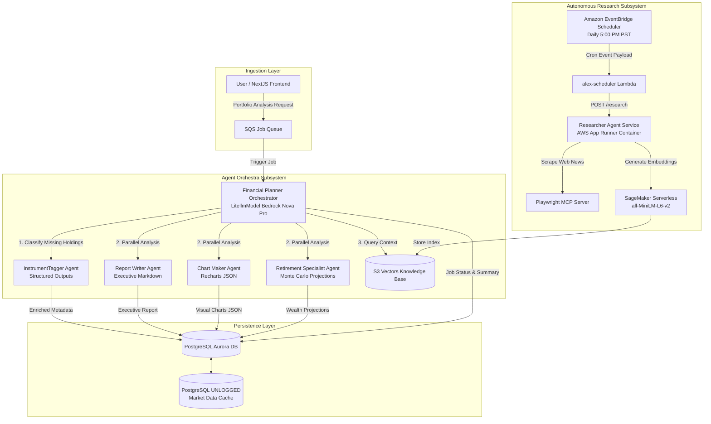

# About Project Alex

Project Alex (Agentic Learning Equities Explainer) is an enterprise-grade, multi-agent SaaS financial planning and portfolio analysis platform. The platform ingests user portfolio data, performs multi-agent analytical orchestration, runs long-term Monte Carlo wealth simulations, executes autonomous web market research, and maintains low-latency cached financial data.

---

## 1. System Purpose and Architecture Overview

Project Alex provides retail investors and financial advisors with automated portfolio insight, asset allocation rebalancing, retirement projections, and real-time financial market intelligence.

### Core Capabilities
- Interactive Portfolio Analysis: Evaluation of equity holdings, asset class distributions, sector exposures, and regional weights.
- Retirement Wealth Projections: Long-term income forecasting and Monte Carlo sustainability analysis.
- Autonomous Market Intelligence: Scheduled web scraping, market news extraction, and vector embedding indexing.
- Ephemeral Market Caching: Sub-millisecond PostgreSQL UNLOGGED cache store delivering 2x–10x latency speedups and mitigating Bedrock LLM token costs.
- Vector Knowledge Base: S3 Native Vectors with SageMaker Serverless embedding extraction yielding ~90% cost savings versus managed search clusters.
- Multi-Tenant Authentication & Isolation: Session security via Clerk with row-level account data isolation.

### System Component Linkages
- REST API Server: [backend/api/main.py](file:///Users/aponte/personal_workspace/agent_engineering_production_udemy.nosync/projects/alex/backend/api/main.py)
- Dependency Injection & Auth Guard: [backend/api/deps.py](file:///Users/aponte/personal_workspace/agent_engineering_production_udemy.nosync/projects/alex/backend/api/deps.py)
- API Controllers: [backend/api/routers/analysis.py](file:///Users/aponte/personal_workspace/agent_engineering_production_udemy.nosync/projects/alex/backend/api/routers/analysis.py), [backend/api/routers/accounts.py](file:///Users/aponte/personal_workspace/agent_engineering_production_udemy.nosync/projects/alex/backend/api/routers/accounts.py), [backend/api/routers/positions.py](file:///Users/aponte/personal_workspace/agent_engineering_production_udemy.nosync/projects/alex/backend/api/routers/positions.py), [backend/api/routers/instruments.py](file:///Users/aponte/personal_workspace/agent_engineering_production_udemy.nosync/projects/alex/backend/api/routers/instruments.py), [backend/api/routers/user.py](file:///Users/aponte/personal_workspace/agent_engineering_production_udemy.nosync/projects/alex/backend/api/routers/user.py)

---

## 2. Multi-Agent Orchestration Framework

Project Alex employs a decoupled multi-agent topology built on the OpenAI Agents SDK and LiteLLM, targeting AWS Bedrock inference engines.

### Framework Primitives and Integration Contracts
- OpenAI Agents SDK: Agents are constructed using standard `openai-agents` primitives (`from agents import Agent, Runner, trace, RunContextWrapper, function_tool`). Execution context and database connection handles pass to tools via `RunContextWrapper`.
- LiteLLM Bedrock Bridge: Agent LLM connections map to AWS Bedrock via `LitellmModel(model=f"bedrock/{model_id}")`. Regional model routing is explicitly enforced by setting `AWS_REGION_NAME`, `BEDROCK_REGION`, `AWS_REGION`, and `AWS_DEFAULT_REGION`.
- Deterministic Execution Scoping: Agents employ either Structured Outputs via Pydantic schemas (for strict metadata classification, e.g. [InstrumentTagger](file:///Users/aponte/personal_workspace/agent_engineering_production_udemy.nosync/projects/alex/backend/tagger/agent.py)) or Function Tool Calling (for dynamic workflow execution, e.g. [Financial Planner](file:///Users/aponte/personal_workspace/agent_engineering_production_udemy.nosync/projects/alex/backend/planner/agent.py)).
- Inference Model Mapping:
  - Amazon Nova Pro (`us.amazon.nova-pro-v1:0`): Powers orchestrations, portfolio tagging, report narratives, dynamic charting, and retirement projections.
  - OpenAI GPT-OSS 120B (`global.openai.gpt-oss-120b-1:0`): Powers autonomous web browsing, market research, and document synthesis.
  - SageMaker Serverless (`all-MiniLM-L6-v2`): Generates 384-dimensional dense feature vectors for document indexing.

### System Agent Topology



### Agent Specifications and Interface Contracts

| Agent Name | Module File | Model / Integration | Execution Input Contract | Artifact Output Contract | Functional Responsibilities |
| :--- | :--- | :--- | :--- | :--- | :--- |
| Financial Planner | [backend/planner/agent.py](file:///Users/aponte/personal_workspace/agent_engineering_production_udemy.nosync/projects/alex/backend/planner/agent.py) | Amazon Nova Pro | `job_id: UUID`, user portfolio holdings | Updates `jobs` table (`report_payload`, `charts_payload`, `retirement_payload`, `summary_payload`) | Master orchestrator. Checks missing instruments, triggers [alex-tagger](file:///Users/aponte/personal_workspace/agent_engineering_production_udemy.nosync/projects/alex/backend/tagger/agent.py), executes sub-agents, queries S3 Vectors, updates job status. |
| InstrumentTagger | [backend/tagger/agent.py](file:///Users/aponte/personal_workspace/agent_engineering_production_udemy.nosync/projects/alex/backend/tagger/agent.py) | Amazon Nova Pro (Structured Outputs) | `missing_symbols: List[str]` | Populates `instruments` table (`allocation_regions`, `allocation_sectors`, `allocation_asset_class`) | Classifies unmapped ticker symbols into regional, sector, and asset class distribution percentages. |
| Report Writer | [backend/reporter/agent.py](file:///Users/aponte/personal_workspace/agent_engineering_production_udemy.nosync/projects/alex/backend/reporter/agent.py) | Amazon Nova Pro | Portfolio allocations, risk metrics, S3 vector research context | Executive Markdown report string in `jobs.report_payload` | Synthesizes portfolio distribution metrics with market research context into an executive Markdown report. Validated by [backend/reporter/judge.py](file:///Users/aponte/personal_workspace/agent_engineering_production_udemy.nosync/projects/alex/backend/reporter/judge.py). |
| Chart Maker | [backend/charter/agent.py](file:///Users/aponte/personal_workspace/agent_engineering_production_udemy.nosync/projects/alex/backend/charter/agent.py) | Amazon Nova Pro | Asset class, sector, and regional percentage metrics | Recharts-compatible JSON payload in `jobs.charts_payload` | Transforms numerical portfolio breakdowns into deterministic JSON schemas formatted for frontend charting components ([backend/charter/templates.py](file:///Users/aponte/personal_workspace/agent_engineering_production_udemy.nosync/projects/alex/backend/charter/templates.py)). |
| Retirement Specialist | [backend/retirement/agent.py](file:///Users/aponte/personal_workspace/agent_engineering_production_udemy.nosync/projects/alex/backend/retirement/agent.py) | Amazon Nova Pro | `years_until_retirement`, `target_retirement_income`, cash & asset values | Forecasting & Monte Carlo JSON payload in `jobs.retirement_payload` | Runs multi-decade wealth accumulation trajectories, safe withdrawal rate analysis, and Monte Carlo failure probability simulations. |
| Researcher | [backend/researcher/server.py](file:///Users/aponte/personal_workspace/agent_engineering_production_udemy.nosync/projects/alex/backend/researcher/server.py) | GPT-OSS 120B / Nova Pro | `POST /research` with optional `topic: str` | Vector embeddings indexed in S3 Vector storage | Runs on AWS App Runner. Uses Playwright MCP ([backend/researcher/mcp_servers.py](file:///Users/aponte/personal_workspace/agent_engineering_production_udemy.nosync/projects/alex/backend/researcher/mcp_servers.py)) to gather market intelligence, embeds content via SageMaker Serverless, and saves vectors. |

---

## 3. Database Architecture, Ephemeral Caching, and Vector Search

### Relational Database Subsystem (PostgreSQL Aurora)
- Source Migration: [backend/database/migrations/001_schema.sql](file:///Users/aponte/personal_workspace/agent_engineering_production_udemy.nosync/projects/alex/backend/database/migrations/001_schema.sql)
- Client Implementation: [backend/database/src/client.py](file:///Users/aponte/personal_workspace/agent_engineering_production_udemy.nosync/projects/alex/backend/database/src/client.py)
- Models & Schemas: [backend/database/src/models.py](file:///Users/aponte/personal_workspace/agent_engineering_production_udemy.nosync/projects/alex/backend/database/src/models.py), [backend/database/src/schemas.py](file:///Users/aponte/personal_workspace/agent_engineering_production_udemy.nosync/projects/alex/backend/database/src/schemas.py)

### Ephemeral Market Data Cache (PostgreSQL `UNLOGGED`)
- Source Migration: [backend/database/migrations/002_unlogged_cache.sql](file:///Users/aponte/personal_workspace/agent_engineering_production_udemy.nosync/projects/alex/backend/database/migrations/002_unlogged_cache.sql)
- Store Implementation: [backend/database/src/unlogged/store.py](file:///Users/aponte/personal_workspace/agent_engineering_production_udemy.nosync/projects/alex/backend/database/src/unlogged/store.py)

#### UNLOGGED Cache Mechanics & Performance Specifications
- WAL Bypass: PostgreSQL `UNLOGGED` tables do not write to the Write-Ahead Log (WAL), eliminating disk I/O bottlenecks and achieving 2x–10x faster execution for write-intensive cache operations.
- Python Store Wrappers: Managed via [UnloggedTableStore](file:///Users/aponte/personal_workspace/agent_engineering_production_udemy.nosync/projects/alex/backend/database/src/unlogged/store.py#L15-L132) and [UnloggedMarketCacheStore](file:///Users/aponte/personal_workspace/agent_engineering_production_udemy.nosync/projects/alex/backend/database/src/unlogged/store.py#L138-L292).
- Key Store Methods:
  - `get_price(symbol, now_epoch)`: Point query returning cached record if `expires_at_epoch > now_epoch`.
  - `set_price(symbol, price, volume, expires_at_epoch)`: Atomic upsert into `market_data_cache`.
  - `get_prices(symbols, now_epoch)`: Batch query returning non-expired price records.
  - `set_prices(prices)`: Batch upsert operation.
  - `delete_expired(now_epoch)`: Purges records where `expires_at_epoch <= now_epoch`.
  - `count(active_only, now_epoch)`: Counts total or active non-expired cached entries.
- Impact: Sub-millisecond ticker lookups prevent rate limits on external market data APIs and eliminate redundant LLM inference token usage.

### S3 Vectors Knowledge Base & Embedding Engine
Ingest module: [backend/ingest/ingest_s3vectors.py](file:///Users/aponte/personal_workspace/agent_engineering_production_udemy.nosync/projects/alex/backend/ingest/ingest_s3vectors.py)
Search module: [backend/ingest/search_s3vectors.py](file:///Users/aponte/personal_workspace/agent_engineering_production_udemy.nosync/projects/alex/backend/ingest/search_s3vectors.py)
Cleanup script: [backend/ingest/cleanup_s3vectors.py](file:///Users/aponte/personal_workspace/agent_engineering_production_udemy.nosync/projects/alex/backend/ingest/cleanup_s3vectors.py)

- Architecture: Uses AWS S3 Native Vectors for high-scale document embedding storage and semantic search, achieving ~90% cost savings ($30/month vs $300+/month for managed OpenSearch clusters).
- Embedding Pipeline: Hosted on a SageMaker Serverless endpoint running `sentence-transformers/all-MiniLM-L6-v2` (384-dimensional vector output).
- Workflow: Scraped articles from the [Researcher](file:///Users/aponte/personal_workspace/agent_engineering_production_udemy.nosync/projects/alex/backend/researcher/server.py) agent are chunked and embedded via SageMaker, then stored in S3 Vectors (`alex-vectors` bucket, `financial-research` index). S3 vector search results ground financial analysis in [Report Writer](file:///Users/aponte/personal_workspace/agent_engineering_production_udemy.nosync/projects/alex/backend/reporter/agent.py) and [Financial Planner](file:///Users/aponte/personal_workspace/agent_engineering_production_udemy.nosync/projects/alex/backend/planner/agent.py).

---

## 4. Automation, Deployment, and System Environment Matrix

### EventBridge Daily Schedule Specification
Source spec: [docs/specs/infrastructure/scheduler_and_deployment_spec.md](file:///Users/aponte/personal_workspace/agent_engineering_production_udemy.nosync/projects/alex/docs/specs/infrastructure/scheduler_and_deployment_spec.md)
Lambda trigger: [backend/scheduler/lambda_function.py](file:///Users/aponte/personal_workspace/agent_engineering_production_udemy.nosync/projects/alex/backend/scheduler/lambda_function.py)
Package script: [backend/package_scheduler.py](file:///Users/aponte/personal_workspace/agent_engineering_production_udemy.nosync/projects/alex/backend/package_scheduler.py)

- Schedule Expression: `cron(0 17 * * ? *)` (executed daily at 5:00 PM PST / `America/Los_Angeles`).
- Execution Flow: EventBridge triggers the `alex-scheduler` Lambda, which issues `POST /research` to the App Runner endpoint (`APP_RUNNER_URL`).
- Configuration Drift Prevention: Schedule parameters are embedded directly in the EventBridge invocation payload to maintain a single source of truth across Terraform and Lambda runtimes.
- Token Optimization: Transitioning from a 2-hour polling frequency to a daily schedule yielded a ~91% reduction in LLM prompt token consumption (~$33.00/month cost savings).

### Deployment Orchestration Pipeline
Deployment script: [backend/deploy_all_lambdas.py](file:///Users/aponte/personal_workspace/agent_engineering_production_udemy.nosync/projects/alex/backend/deploy_all_lambdas.py)
Docker builder: [backend/package_docker.py](file:///Users/aponte/personal_workspace/agent_engineering_production_udemy.nosync/projects/alex/backend/package_docker.py)
Terraform agent manifests: [terraform/6_agents/main.tf](file:///Users/aponte/personal_workspace/agent_engineering_production_udemy.nosync/projects/alex/terraform/6_agents/main.tf)
Terraform researcher manifests: [terraform/4_researcher/main.tf](file:///Users/aponte/personal_workspace/agent_engineering_production_udemy.nosync/projects/alex/terraform/4_researcher/main.tf)

The Python deployment script ([backend/deploy_all_lambdas.py](file:///Users/aponte/personal_workspace/agent_engineering_production_udemy.nosync/projects/alex/backend/deploy_all_lambdas.py)) coordinates building and updating all 7 platform Lambda functions:
1. Agent Orchestra Lambdas (5): `alex-planner`, `alex-tagger`, `alex-reporter`, `alex-charter`, `alex-retirement`.
2. Research Subsystem Lambdas (2): `alex-scheduler`, `alex-researcher`.

Execution steps:
1. Optional packaging via `--package` flag.
2. Resource tainting: Executes `terraform taint` on `aws_lambda_function` resources in both `terraform/6_agents` and `terraform/4_researcher`.
3. Automated terraform apply: Deploys updated code packages and syncs infrastructure state.

### Explicit Environment Variables Matrix

| Environment Variable | Target Component / File Module | Required / Optional | Default Value | Technical Purpose |
| :--- | :--- | :--- | :--- | :--- |
| `AWS_REGION_NAME` | LiteLLM Bedrock Bridge across all agents | Required | `us-west-2` | Explicit region override required by LiteLLM for Bedrock inference profile resolution. |
| `BEDROCK_REGION` | [backend/planner/agent.py](file:///Users/aponte/personal_workspace/agent_engineering_production_udemy.nosync/projects/alex/backend/planner/agent.py), [backend/tagger/agent.py](file:///Users/aponte/personal_workspace/agent_engineering_production_udemy.nosync/projects/alex/backend/tagger/agent.py), [backend/reporter/agent.py](file:///Users/aponte/personal_workspace/agent_engineering_production_udemy.nosync/projects/alex/backend/reporter/agent.py), [backend/charter/agent.py](file:///Users/aponte/personal_workspace/agent_engineering_production_udemy.nosync/projects/alex/backend/charter/agent.py), [backend/retirement/agent.py](file:///Users/aponte/personal_workspace/agent_engineering_production_udemy.nosync/projects/alex/backend/retirement/agent.py), [backend/researcher/server.py](file:///Users/aponte/personal_workspace/agent_engineering_production_udemy.nosync/projects/alex/backend/researcher/server.py) | Required | `us-west-2` | AWS region where Bedrock LLM endpoints are provisioned. |
| `AWS_REGION` / `AWS_DEFAULT_REGION` | Bedrock & Boto3 SDK clients | Required | `us-west-2` | Standard AWS SDK region configuration. |
| `BEDROCK_MODEL_ID` | Agent Orchestra modules | Optional | `us.amazon.nova-pro-v1:0` | Amazon Nova Pro inference profile ID for portfolio analysis agents. |
| `RESEARCHER_MODEL` | [backend/researcher/server.py](file:///Users/aponte/personal_workspace/agent_engineering_production_udemy.nosync/projects/alex/backend/researcher/server.py) | Optional | `bedrock/global.openai.gpt-oss-120b-1:0` | Bedrock model identifier for the Researcher agent. |
| `AURORA_CLUSTER_ARN` | [backend/database/src/client.py](file:///Users/aponte/personal_workspace/agent_engineering_production_udemy.nosync/projects/alex/backend/database/src/client.py), [backend/database/run_migrations.py](file:///Users/aponte/personal_workspace/agent_engineering_production_udemy.nosync/projects/alex/backend/database/run_migrations.py) | Required in AWS | None | AWS Secrets Manager / Data API target cluster ARN for Aurora PostgreSQL. |
| `AURORA_SECRET_ARN` | [backend/database/src/client.py](file:///Users/aponte/personal_workspace/agent_engineering_production_udemy.nosync/projects/alex/backend/database/src/client.py) | Required in AWS | None | AWS Secrets Manager secret ARN containing Aurora DB credentials. |
| `AURORA_DATABASE` | [backend/database/src/client.py](file:///Users/aponte/personal_workspace/agent_engineering_production_udemy.nosync/projects/alex/backend/database/src/client.py) | Optional | `alex` | PostgreSQL database name on the Aurora cluster. |
| `DEFAULT_AWS_REGION` | [backend/api/deps.py](file:///Users/aponte/personal_workspace/agent_engineering_production_udemy.nosync/projects/alex/backend/api/deps.py), Database Client | Optional | `us-east-1` | Default AWS region for SQS, RDS Data API, and AWS SDK operations. |
| `APP_RUNNER_URL` | [backend/scheduler/lambda_function.py](file:///Users/aponte/personal_workspace/agent_engineering_production_udemy.nosync/projects/alex/backend/scheduler/lambda_function.py) | Required | None | Endpoint URL for the AWS App Runner container hosting the Researcher service. |
| `VECTOR_BUCKET` | [backend/ingest/ingest_s3vectors.py](file:///Users/aponte/personal_workspace/agent_engineering_production_udemy.nosync/projects/alex/backend/ingest/ingest_s3vectors.py), [backend/ingest/search_s3vectors.py](file:///Users/aponte/personal_workspace/agent_engineering_production_udemy.nosync/projects/alex/backend/ingest/search_s3vectors.py) | Optional | `alex-vectors` | S3 bucket storing vector index artifacts and embeddings. |
| `SAGEMAKER_ENDPOINT` | Ingestion & Search scripts | Required in AWS | `alex-embedding-endpoint` | SageMaker Serverless endpoint hosting `all-MiniLM-L6-v2`. |
| `INDEX_NAME` | Vector Ingestion & Search scripts | Optional | `financial-research` | Vector index namespace within S3 Vectors. |
| `TAGGER_FUNCTION` | [backend/planner/agent.py](file:///Users/aponte/personal_workspace/agent_engineering_production_udemy.nosync/projects/alex/backend/planner/agent.py) | Optional | `alex-tagger` | AWS Lambda function name for the InstrumentTagger agent. |
| `REPORTER_FUNCTION` | [backend/planner/agent.py](file:///Users/aponte/personal_workspace/agent_engineering_production_udemy.nosync/projects/alex/backend/planner/agent.py) | Optional | `alex-reporter` | AWS Lambda function name for the Report Writer agent. |
| `CHARTER_FUNCTION` | [backend/planner/agent.py](file:///Users/aponte/personal_workspace/agent_engineering_production_udemy.nosync/projects/alex/backend/planner/agent.py) | Optional | `alex-charter` | AWS Lambda function name for the Chart Maker agent. |
| `RETIREMENT_FUNCTION` | [backend/planner/agent.py](file:///Users/aponte/personal_workspace/agent_engineering_production_udemy.nosync/projects/alex/backend/planner/agent.py) | Optional | `alex-retirement` | AWS Lambda function name for the Retirement Specialist agent. |
| `SQS_QUEUE_URL` | [backend/api/deps.py](file:///Users/aponte/personal_workspace/agent_engineering_production_udemy.nosync/projects/alex/backend/api/deps.py) | Required in API | None | SQS queue URL for asynchronous portfolio analysis job queuing. |
| `CLERK_JWKS_URL` | [backend/api/deps.py](file:///Users/aponte/personal_workspace/agent_engineering_production_udemy.nosync/projects/alex/backend/api/deps.py) | Required in API | None | Clerk JSON Web Key Set URL for validating JWT user authentication tokens. |
| `CORS_ORIGINS` | [backend/api/main.py](file:///Users/aponte/personal_workspace/agent_engineering_production_udemy.nosync/projects/alex/backend/api/main.py) | Optional | `http://localhost:3000` | Comma-separated list of origins allowed by CORS middleware. |
| `MOCK_LAMBDAS` | [backend/planner/agent.py](file:///Users/aponte/personal_workspace/agent_engineering_production_udemy.nosync/projects/alex/backend/planner/agent.py) | Optional | `false` | When set to `true`, mocks sub-agent Lambda invocations for local unit testing. |
| `MCP_LOGGING` | [backend/researcher/server.py](file:///Users/aponte/personal_workspace/agent_engineering_production_udemy.nosync/projects/alex/backend/researcher/server.py) | Optional | `false` | When set to `True`, enables verbose logging for Playwright MCP tool calls. |
| `LANGFUSE_SECRET_KEY` | [backend/charter/observability.py](file:///Users/aponte/personal_workspace/agent_engineering_production_udemy.nosync/projects/alex/backend/charter/observability.py) | Optional | None | Optional telemetry tracing key for Langfuse observability. |

---

## 5. Specification Harness (`docs/specs/`)

The [docs/specs/](file:///Users/aponte/personal_workspace/agent_engineering_production_udemy.nosync/projects/alex/docs/specs/) directory functions as the LLM Agent Document Harness for Project Alex. It establishes a formal, machine-readable contract framework governing schema migrations, agent interfaces, API endpoints, and infrastructure deployments.

### Harness Purpose and Execution Rules
1. Single Source of Truth: Specifications in [docs/specs/](file:///Users/aponte/personal_workspace/agent_engineering_production_udemy.nosync/projects/alex/docs/specs/) define exact system behavior, SQL DDL migrations, FastAPI DTO schemas, and infrastructure properties before implementation.
2. Deterministic Agent Workflows: Prevents AI agents from assuming implicit schema properties, inferring undocumented signatures, or introducing breaking architectural side effects.
3. Spec-Driven Development Protocol:
   - Phase 1 (Plan & Specify): Draft formal specification documents detailing schemas, types, and API signatures in `docs/specs/`.
   - Phase 2 (Audit & Align): Engineers and AI agents audit code implementations against spec definitions.
   - Phase 3 (Implement & Verify): Agents execute file modifications and validate changes using automated test suites.

### Harness Directory Topology

```
docs/
├── About.md                                                      # System architecture & agent context guide
└── specs/                                                        # LLM Agent Document Harness
    ├── infrastructure/                                           # Deployment & automation specifications
    │   └── scheduler_and_deployment_spec.md                      # Spec for EventBridge scheduler & deploy_all_lambdas.py
    ├── database/                                                 # SQL schema & UNLOGGED cache specifications
    ├── agents/                                                   # Agent SDK prompt, tool, & model contracts
    └── api/                                                      # FastAPI endpoints & Pydantic DTO contracts
```
