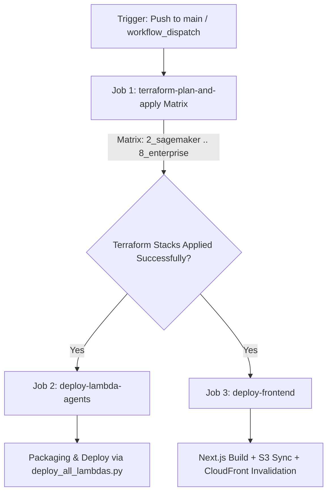

# Specification: Continuous Deployment (CD) Workflow & Production Infrastructure Release 🚀

## Status: APPROVED
**Module**: `infrastructure / cd / github_actions`  
**Target Files**:
- [.github/workflows/cd.yml](file:///Users/aponte/personal_workspace/agent_engineering_production_udemy/projects/alex/.github/workflows/cd.yml)
- [backend/deploy_all_lambdas.py](file:///Users/aponte/personal_workspace/agent_engineering_production_udemy/projects/alex/backend/deploy_all_lambdas.py)
- [frontend/package.json](file:///Users/aponte/personal_workspace/agent_engineering_production_udemy/projects/alex/frontend/package.json)
- [terraform/2_sagemaker/main.tf](file:///Users/aponte/personal_workspace/agent_engineering_production_udemy/projects/alex/terraform/2_sagemaker/main.tf)
- [terraform/3_ingestion/main.tf](file:///Users/aponte/personal_workspace/agent_engineering_production_udemy/projects/alex/terraform/3_ingestion/main.tf)
- [terraform/4_researcher/main.tf](file:///Users/aponte/personal_workspace/agent_engineering_production_udemy/projects/alex/terraform/4_researcher/main.tf)
- [terraform/5_database/main.tf](file:///Users/aponte/personal_workspace/agent_engineering_production_udemy/projects/alex/terraform/5_database/main.tf)
- [terraform/6_agents/main.tf](file:///Users/aponte/personal_workspace/agent_engineering_production_udemy/projects/alex/terraform/6_agents/main.tf)
- [terraform/7_frontend/main.tf](file:///Users/aponte/personal_workspace/agent_engineering_production_udemy/projects/alex/terraform/7_frontend/main.tf)
- [terraform/8_enterprise/main.tf](file:///Users/aponte/personal_workspace/agent_engineering_production_udemy/projects/alex/terraform/8_enterprise/main.tf)
- [docs/specs/infrastructure/github_cd_spec.md](file:///Users/aponte/personal_workspace/agent_engineering_production_udemy/projects/alex/docs/specs/infrastructure/github_cd_spec.md)

---

## 1. Executive Summary & Objectives

This specification defines the production-grade Continuous Deployment (CD) pipeline architecture for Project Alex. The CD workflow orchestrates automated infrastructure provisioning, multi-stack Terraform execution, containerized Lambda agent packaging and deployment, Next.js frontend building, S3 asset synchronization, and CloudFront CDN cache invalidations upon merging code to the `main` branch or manual dispatch.

### Key Objectives & Architectural Principles:
1. **Automated Continuous Deployment Scope**: Automatically deploys infrastructure, agent code, and frontend updates on pushes to `main` or via manual `workflow_dispatch`.
2. **Passwordless AWS Authentication (OIDC)**: Integrates GitHub Actions OpenID Connect (OIDC) identity provider federation (`aws-actions/configure-aws-credentials`) using IAM role assumption (`role-to-assume: ${{ secrets.AWS_ROLE_ARN }}`), eliminating long-lived access key secrets.
3. **Terraform Stack Matrix Provisioning**: Executes `terraform fmt -check`, `terraform init`, `terraform validate`, and `terraform apply -auto-approve` sequentially across all active Terraform modules (`2_sagemaker` through `8_enterprise`).
4. **Unified Containerized Lambda Agent Deployment**: Packages and deploys all platform Lambda functions via [backend/deploy_all_lambdas.py](file:///Users/aponte/personal_workspace/agent_engineering_production_udemy/projects/alex/backend/deploy_all_lambdas.py) using `astral-sh/setup-uv@v5` and Docker for multi-stage dependency compilation.
5. **Frontend Asset Delivery & CDN Cache Invalidation**: Builds the Next.js production web application (`npm run build` in [frontend/](file:///Users/aponte/personal_workspace/agent_engineering_production_udemy/projects/alex/frontend/)), synchronizes compiled static artifacts to S3 (`aws s3 sync`), and invalidates CloudFront distributions (`aws cloudfront create-invalidation`).
6. **Harness Standard Compliance**: Fully adheres to the harness architecture defined in [docs/specs/llm_agent_harness_spec.md](file:///Users/aponte/personal_workspace/agent_engineering_production_udemy/projects/alex/docs/specs/llm_agent_harness_spec.md).

> [!IMPORTANT]
> Infrastructure deployment safety is governed by non-preemptive concurrency locks (`cancel-in-progress: false`). Ongoing `terraform apply` operations are never aborted mid-execution, protecting state backends against lock corruption.

---

## 2. Technical Contracts & Interface Specifications

### 2.1 Workflow Triggers & Execution Scope

The CD pipeline triggers on direct commits or merged pull requests to `main`, as well as manual triggers via GitHub Actions UI:

```yaml
on:
  push:
    branches:
      - main
  workflow_dispatch:
```

#### Concurrency Policy:
To ensure infrastructure state lock integrity and prevent concurrent state corruption during `terraform apply` operations, the workflow enforces non-preemptive execution:

```yaml
concurrency:
  group: cd-main-${{ github.ref }}
  cancel-in-progress: false
```

---

### 2.2 AWS IAM OIDC Authentication Protocol

The pipeline utilizes temporary AWS security credentials generated through IAM OpenID Connect (OIDC) federation. Long-lived `AWS_ACCESS_KEY_ID` and `AWS_SECRET_ACCESS_KEY` pair usage is prohibited.

#### Required Action Permissions:
To request the OIDC JSON Web Token (JWT) from GitHub's OIDC provider, job definitions MUST declare top-level or job-level `permissions`:

```yaml
permissions:
  id-token: write
  contents: read
```

#### Authentication Step Contract:
```yaml
- name: Configure AWS Credentials via OIDC
  uses: aws-actions/configure-aws-credentials@v4
  with:
    role-to-assume: ${{ secrets.AWS_ROLE_ARN }}
    aws-region: ${{ secrets.AWS_REGION || 'us-east-1' }}
    role-session-name: Alex-CD-GitHubActions
```

> [!NOTE]
> The IAM Role assumed by GitHub Actions must configure an OIDC Trust Policy allowing `repo:<org>/<repo>:ref:refs/heads/main` or `repo:<org>/<repo>:*` with claim audience `sts.amazonaws.com`.

---

### 2.3 Pipeline Job Architecture & Topology

The CD pipeline comprises **3 main jobs**:



#### CD Job Interface Matrix:

| Job ID | Description & Scope | Target Working Directory | Execution Commands & CLI | Dependencies (`needs`) |
| :--- | :--- | :--- | :--- | :--- |
| `terraform-plan-and-apply` | Matrix provisioning across Terraform stacks (`2_sagemaker` through `8_enterprise`) | `terraform/${{ matrix.stack }}` | `terraform fmt -check`<br>`terraform init`<br>`terraform validate`<br>`terraform apply -auto-approve` | *None (Initial Gate)* |
| `deploy-lambda-agents` | Unified Lambda packaging and resource recreation for agent & researcher functions | [backend/](file:///Users/aponte/personal_workspace/agent_engineering_production_udemy/projects/alex/backend/) | `uv run deploy_all_lambdas.py --package` | `terraform-plan-and-apply` |
| `deploy-frontend` | Static page generation, S3 sync, and CloudFront edge cache invalidation | [frontend/](file:///Users/aponte/personal_workspace/agent_engineering_production_udemy/projects/alex/frontend/) | `npm ci`<br>`npm run build`<br>`aws s3 sync out/ s3://${{ secrets.AWS_S3_FRONTEND_BUCKET }} --delete`<br>`aws cloudfront create-invalidation` | `terraform-plan-and-apply` |

---

### 2.4 Terraform Matrix Execution Protocol

The `terraform-plan-and-apply` job runs across a matrix of the 7 Terraform modules defining Project Alex infrastructure:

```yaml
strategy:
  fail-fast: true
  max-parallel: 1  # Ensures sequential stack application to prevent dependency race conditions
  matrix:
    stack:
      - 2_sagemaker
      - 3_ingestion
      - 4_researcher
      - 5_database
      - 6_agents
      - 7_frontend
      - 8_enterprise
```

> [!TIP]
> `max-parallel: 1` guarantees strictly ordered execution (`2_sagemaker` → `3_ingestion` → `4_researcher` → `5_database` → `6_agents` → `7_frontend` → `8_enterprise`), matching cross-stack dependency order. `fail-fast: true` immediately halts execution if any preceding stack fails.

For each stack item in the matrix, the job executes four mandatory Terraform lifecycle commands:
1. `terraform fmt -check`: Verifies HCL syntax formatting.
2. `terraform init`: Initializes remote state backends and provider plugins.
3. `terraform validate`: Validates resource schema and reference integrity.
4. `terraform apply -auto-approve`: Applies infrastructure changes non-interactively.

---

### 2.5 Lambda Agent Packaging & Deployment Contract

The `deploy-lambda-agents` job invokes [backend/deploy_all_lambdas.py](file:///Users/aponte/personal_workspace/agent_engineering_production_udemy/projects/alex/backend/deploy_all_lambdas.py), which orchestrates:
- Invoking `package_docker.py` across agent subdirectories (`planner`, `tagger`, `reporter`, `charter`, `retirement`).
- Packaging the research scheduler via [backend/scheduler/package_scheduler.py](file:///Users/aponte/personal_workspace/agent_engineering_production_udemy/projects/alex/backend/scheduler/package_scheduler.py).
- Tainting `aws_lambda_function` resources in [terraform/6_agents](file:///Users/aponte/personal_workspace/agent_engineering_production_udemy/projects/alex/terraform/6_agents) and [terraform/4_researcher](file:///Users/aponte/personal_workspace/agent_engineering_production_udemy/projects/alex/terraform/4_researcher) to guarantee zip updates on deployment.
- Executing `terraform apply -auto-approve` on agent and researcher stacks.

#### Key Setup Requirements:
- Python environment managed by `astral-sh/setup-uv@v5` with caching enabled.
- Active Docker engine service on the runner (standard in `ubuntu-latest`) for multi-stage `linux/amd64` dependency compilation.

---

### 2.6 Frontend Build & CDN Invalidation Contract

The `deploy-frontend` job compiles the Next.js single-page frontend application in [frontend/](file:///Users/aponte/personal_workspace/agent_engineering_production_udemy/projects/alex/frontend/) and deploys it to AWS S3 and CloudFront:

1. **Build Environment Binding**: Pass Clerk publishable key and API endpoints to Next.js during static site compilation (`npm run build`).
2. **S3 Asset Synchronization**: Execute `aws s3 sync frontend/out/ s3://${{ secrets.AWS_S3_FRONTEND_BUCKET }} --delete` to upload updated static assets.
3. **CloudFront CDN Cache Invalidation**: Clear edge caches using `aws cloudfront create-invalidation --distribution-id ${{ secrets.CLOUDFRONT_DISTRIBUTION_ID }} --paths "/*"`.

---

### 2.7 Required Environment Variables & GitHub Secrets Matrix

The CD pipeline relies on repository secrets and environment variables configured within GitHub:

| Secret / Var Name | Description | Required By Job | Example / Usage |
| :--- | :--- | :--- | :--- |
| `AWS_ROLE_ARN` | AWS IAM Role ARN configured for GitHub Actions OIDC trust relationship | All Jobs (`configure-aws-credentials`) | `arn:aws:iam::123456789012:role/alex-github-actions-cd-role` |
| `AWS_REGION` | Target AWS deployment region | All Jobs | `us-east-1` |
| `NEXT_PUBLIC_CLERK_PUBLISHABLE_KEY` | Clerk publishable key for Next.js pre-rendering | `deploy-frontend` | `pk_test_...` |
| `CLERK_SECRET_KEY` | Clerk API secret key for backend authentication | `deploy-frontend` | `sk_test_...` |
| `CLERK_JWKS_URL` | Clerk JWKS URL for JWT validation in API Gateway Lambda | `terraform-plan-and-apply` (`7_frontend`), `deploy-lambda-agents` | `https://<clerk-domain>/.well-known/jwks.json` |
| `AWS_S3_FRONTEND_BUCKET` | S3 bucket name created by `7_frontend` Terraform stack | `deploy-frontend` | `alex-frontend-123456789012` |
| `CLOUDFRONT_DISTRIBUTION_ID` | CloudFront Distribution ID created by `7_frontend` Terraform stack | `deploy-frontend` | `E1A2B3C4D5E6F7` |
| `POLYGON_API_KEY` | Polygon.io API key for real-time market price data | `terraform-plan-and-apply` (`6_agents`), `deploy-lambda-agents` | `poly_key_...` |
| `OPENAI_API_KEY` | OpenAI API key for Researcher Lambda and Agents SDK tracing | `terraform-plan-and-apply` (`4_researcher`, `6_agents`), `deploy-lambda-agents` | `sk-proj-...` |
| `ALEX_API_KEY` | Internal Alex API key for inter-service communication | `terraform-plan-and-apply` (`4_researcher`) | `alex_secret_key_...` |

---

## 3. Implementation Plan & Execution Steps

Below is the complete, production-grade GitHub Actions workflow definition target for [.github/workflows/cd.yml](file:///Users/aponte/personal_workspace/agent_engineering_production_udemy/projects/alex/.github/workflows/cd.yml):

```yaml
name: Continuous Deployment

on:
  push:
    branches:
      - main
  workflow_dispatch:

concurrency:
  group: cd-main-${{ github.ref }}
  cancel-in-progress: false

permissions:
  id-token: write
  contents: read

jobs:
  # ---------------------------------------------------------------------------
  # Job 1: Terraform Plan & Apply Matrix (Stacks 2_sagemaker through 8_enterprise)
  # ---------------------------------------------------------------------------
  terraform-plan-and-apply:
    name: Terraform Apply (${{ matrix.stack }})
    runs-on: ubuntu-latest
    timeout-minutes: 30
    strategy:
      fail-fast: true
      max-parallel: 1
      matrix:
        stack:
          - 2_sagemaker
          - 3_ingestion
          - 4_researcher
          - 5_database
          - 6_agents
          - 7_frontend
          - 8_enterprise

    steps:
      - name: Checkout Code
        uses: actions/checkout@v4

      - name: Configure AWS Credentials via OIDC
        uses: aws-actions/configure-aws-credentials@v4
        with:
          role-to-assume: ${{ secrets.AWS_ROLE_ARN }}
          aws-region: ${{ secrets.AWS_REGION || 'us-east-1' }}
          role-session-name: Alex-CD-Terraform-${{ matrix.stack }}

      - name: Setup Terraform CLI
        uses: hashicorp/setup-terraform@v3
        with:
          terraform_version: "1.9.0"

      - name: Terraform Format Check
        working-directory: terraform/${{ matrix.stack }}
        run: terraform fmt -check

      - name: Terraform Init
        working-directory: terraform/${{ matrix.stack }}
        run: terraform init

      - name: Terraform Validate
        working-directory: terraform/${{ matrix.stack }}
        run: terraform validate

      - name: Terraform Apply
        working-directory: terraform/${{ matrix.stack }}
        env:
          TF_VAR_aws_region: ${{ secrets.AWS_REGION || 'us-east-1' }}
          TF_VAR_clerk_jwks_url: ${{ secrets.CLERK_JWKS_URL }}
          TF_VAR_polygon_api_key: ${{ secrets.POLYGON_API_KEY }}
          TF_VAR_openai_api_key: ${{ secrets.OPENAI_API_KEY }}
          TF_VAR_alex_api_key: ${{ secrets.ALEX_API_KEY }}
        run: terraform apply -auto-approve

  # ---------------------------------------------------------------------------
  # Job 2: Unified Lambda Agent Deployment (Using Pre-built CI Packages)
  # ---------------------------------------------------------------------------
  deploy-lambda-agents:
    name: Deploy Lambda Agents & Subsystems
    runs-on: ubuntu-latest
    needs: terraform-plan-and-apply
    timeout-minutes: 20
    steps:
      - name: Checkout Code
        uses: actions/checkout@v4

      - name: Configure AWS Credentials via OIDC
        uses: aws-actions/configure-aws-credentials@v4
        with:
          role-to-assume: ${{ secrets.AWS_ROLE_ARN }}
          aws-region: ${{ secrets.AWS_REGION || 'us-east-1' }}
          role-session-name: Alex-CD-Lambda-Deploy

      - name: Download Lambda Agent Packages Artifact
        uses: actions/download-artifact@v4
        with:
          name: lambda-agent-packages
          path: backend/

      - name: Setup Python & uv
        uses: astral-sh/setup-uv@v5
        with:
          version: "latest"
          enable-cache: true
          cache-dependency-glob: "backend/uv.lock"

      - name: Setup Terraform CLI
        uses: hashicorp/setup-terraform@v3
        with:
          terraform_version: "1.9.0"

      - name: Install Backend Dependencies
        working-directory: backend
        run: uv sync

      - name: Execute Lambda Deployment Script
        working-directory: backend
        env:
          TF_VAR_aws_region: ${{ secrets.AWS_REGION || 'us-east-1' }}
          TF_VAR_clerk_jwks_url: ${{ secrets.CLERK_JWKS_URL }}
          TF_VAR_polygon_api_key: ${{ secrets.POLYGON_API_KEY }}
          TF_VAR_openai_api_key: ${{ secrets.OPENAI_API_KEY }}
          TF_VAR_alex_api_key: ${{ secrets.ALEX_API_KEY }}
        run: uv run deploy_all_lambdas.py

  # ---------------------------------------------------------------------------
  # Job 3: Frontend Deploy S3 Sync & CloudFront Invalidation (Using Pre-built CI Artifacts)
  # ---------------------------------------------------------------------------
  deploy-frontend:
    name: Deploy Next.js Frontend & Invalidate CloudFront
    runs-on: ubuntu-latest
    needs: terraform-plan-and-apply
    timeout-minutes: 15
    steps:
      - name: Checkout Code
        uses: actions/checkout@v4

      - name: Configure AWS Credentials via OIDC
        uses: aws-actions/configure-aws-credentials@v4
        with:
          role-to-assume: ${{ secrets.AWS_ROLE_ARN }}
          aws-region: ${{ secrets.AWS_REGION || 'us-east-1' }}
          role-session-name: Alex-CD-Frontend-Deploy

      - name: Download Frontend Static Export Artifact
        uses: actions/download-artifact@v4
        with:
          name: frontend-static-build
          path: frontend/out

      - name: Sync Static Frontend Artifacts to S3
        run: |
          aws s3 sync frontend/out/ s3://${{ secrets.AWS_S3_FRONTEND_BUCKET }} --delete

      - name: Invalidate CloudFront CDN Cache
        run: |
          aws cloudfront create-invalidation \
            --distribution-id ${{ secrets.CLOUDFRONT_DISTRIBUTION_ID }} \
            --paths "/*"
```

---

## 4. Verification & Testing Requirements

### 4.1 Pre-deployment Local Verification Commands

Before committing workflow updates, engineers and AI agents can execute equivalent local verification commands:

```bash
# 1. Verify Terraform Formatting & Validation across Stacks
for dir in terraform/*/; do
  if [ -f "$dir/main.tf" ]; then
    echo "Checking $dir..."
    (cd "$dir" && terraform fmt -check && terraform init -backend=false && terraform validate)
  fi
done

# 2. Verify Lambda Packaging & Deployment Script Execution (Dry-run / Package check)
cd backend && uv run deploy_all_lambdas.py --package

# 3. Verify Frontend Next.js Production Build
cd frontend && npm ci && NEXT_PUBLIC_CLERK_PUBLISHABLE_KEY="pk_test_sample" npm run build
```

### 4.2 GitHub Actions Live Verification Checklist

When triggering a CD pipeline run on `main` or via `workflow_dispatch`:
1. **OIDC Authentication Check**: Confirm `Configure AWS Credentials via OIDC` step successfully assumes `AWS_ROLE_ARN` without requesting long-lived AWS keys.
2. **Terraform Matrix Audit**: Confirm all 7 Terraform stacks (`2_sagemaker` through `8_enterprise`) complete `terraform apply` cleanly in sequential order.
3. **Lambda Agent Verification**: Confirm `deploy-lambda-agents` packages all 6 agent zip files + 1 scheduler zip file and completes deployment without error exit codes.
4. **Frontend & CDN Audit**: Verify S3 sync uploads all build assets to `AWS_S3_FRONTEND_BUCKET` and CloudFront invalidation produces an `invalidation-id` with `Status: InProgress` or `Completed`.
