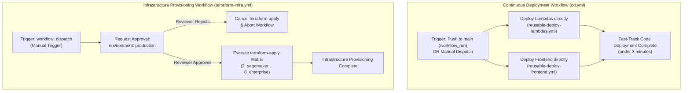

# Specification: Decoupled Continuous Deployment (CD) & Production Infrastructure Release 🚀

## Status: APPROVED
**Module**: `infrastructure / cd / github_actions`  
**Target Files**:
- [.github/workflows/cd.yml](file:///Users/aponte/personal_workspace/agent_engineering_production_udemy/projects/alex/.github/workflows/cd.yml)
- [.github/workflows/terraform-infra.yml](file:///Users/aponte/personal_workspace/agent_engineering_production_udemy/projects/alex/.github/workflows/terraform-infra.yml)
- [.github/workflows/reusable-terraform-apply.yml](file:///Users/aponte/personal_workspace/agent_engineering_production_udemy/projects/alex/.github/workflows/reusable-terraform-apply.yml)
- [.github/workflows/reusable-deploy-lambdas.yml](file:///Users/aponte/personal_workspace/agent_engineering_production_udemy/projects/alex/.github/workflows/reusable-deploy-lambdas.yml)
- [.github/workflows/reusable-deploy-frontend.yml](file:///Users/aponte/personal_workspace/agent_engineering_production_udemy/projects/alex/.github/workflows/reusable-deploy-frontend.yml)
- [backend/deploy_all_lambdas.py](file:///Users/aponte/personal_workspace/agent_engineering_production_udemy/projects/alex/backend/deploy_all_lambdas.py)
- [frontend/package.json](file:///Users/aponte/personal_workspace/agent_engineering_production_udemy/projects/alex/frontend/package.json)
- [terraform/2_sagemaker/main.tf](file:///Users/aponte/personal_workspace/agent_engineering_production_udemy/projects/alex/terraform/2_sagemaker/main.tf)
- [terraform/3_ingestion/main.tf](file:///Users/aponte/personal_workspace/agent_engineering_production_udemy/projects/alex/terraform/3_ingestion/main.tf)
- [terraform/4_researcher/main.tf](file:///Users/aponte/personal_workspace/agent_engineering_production_udemy/projects/alex/terraform/4_researcher/main.tf)
- [terraform/5_database/main.tf](file:///Users/aponte/personal_workspace/agent_engineering_production_udemy/projects/alex/terraform/5_database/main.tf)
- [terraform/6_agents/main.tf](file:///Users/aponte/personal_workspace/agent_engineering_production_udemy/projects/alex/terraform/6_agents/main.tf)
- [terraform/7_frontend/main.tf](file:///Users/aponte/personal_workspace/agent_engineering_production_udemy/projects/alex/terraform/7_frontend/main.tf)
- [terraform/8_enterprise/main.tf](file:///Users/aponte/personal_workspace/agent_engineering_production_udemy/projects/alex/terraform/8_enterprise/main.tf)
- [docs/specs/infrastructure/github_cd_spec.md](file:///Users/aponte/personal_workspace/agent_engineering_production_udemy/projects/alex/docs/specs/infrastructure/github_cd_spec.md)

---

## 1. Executive Summary & Objectives

This specification defines the production-grade **Decoupled Infrastructure Stack Gated Deployment Architecture** for Project Alex using a **composable Reusable Workflow (`workflow_call`) design**.

Under this decoupled architecture:
1. **Application CD (`cd.yml`)**: Fast-tracks routine code releases (Lambdas & Frontend) directly to existing infrastructure without running Terraform state checks or risk of accidental infrastructure mutation. Routine deployments complete in **under 3 minutes**.
2. **Infrastructure Provisioning (`terraform-infra.yml`)**: Infrastructure stack matrix provisioning (`2_sagemaker` through `8_enterprise`) is completely decoupled into a manual workflow gated behind mandatory human approval via `environment: production`.
3. **Complete Removal of `deploy_infra`**: The legacy `deploy_infra` boolean input option has been completely removed from [.github/workflows/cd.yml](file:///Users/aponte/personal_workspace/agent_engineering_production_udemy/projects/alex/.github/workflows/cd.yml).

### Key Objectives & Architectural Principles:
1. **Decoupled Continuous Deployment Architecture**: Cleanly separates fast-track application code delivery ([`cd.yml`](file:///Users/aponte/personal_workspace/agent_engineering_production_udemy/projects/alex/.github/workflows/cd.yml)) from human-gated infrastructure provisioning ([`terraform-infra.yml`](file:///Users/aponte/personal_workspace/agent_engineering_production_udemy/projects/alex/.github/workflows/terraform-infra.yml)).
2. **Automated Application CD Scope**: Automatically triggers code deployment following successful completion of the CI workflow ([docs/specs/infrastructure/github_ci_spec.md](file:///Users/aponte/personal_workspace/agent_engineering_production_udemy/projects/alex/docs/specs/infrastructure/github_ci_spec.md)) on `main` via `workflow_run` events, or on-demand via manual `workflow_dispatch`.
3. **Protected Infrastructure Environment Gate**: Terraform stack matrix provisioning (`2_sagemaker` through `8_enterprise`) inside [`reusable-terraform-apply.yml`](file:///Users/aponte/personal_workspace/agent_engineering_production_udemy/projects/alex/.github/workflows/reusable-terraform-apply.yml) requires manual review and approval bound to `environment: production`.
4. **Passwordless AWS Authentication (OIDC)**: Integrates GitHub Actions OpenID Connect (OIDC) identity provider federation (`aws-actions/configure-aws-credentials`) using IAM role assumption (`role-to-assume: ${{ secrets.AWS_ROLE_ARN }}`), eliminating long-lived access key secrets.
5. **Consuming Pre-Packaged Lambda Artifacts**: Downloads the 6 individual Lambda package artifacts (`lambda-package-planner`, `lambda-package-tagger`, `lambda-package-reporter`, `lambda-package-charter`, `lambda-package-retirement`, `lambda-package-scheduler`) into their respective `backend/` subdirectories and invokes [backend/deploy_all_lambdas.py](file:///Users/aponte/personal_workspace/agent_engineering_production_udemy/projects/alex/backend/deploy_all_lambdas.py) **without** the `--package` flag inside [`reusable-deploy-lambdas.yml`](file:///Users/aponte/personal_workspace/agent_engineering_production_udemy/projects/alex/.github/workflows/reusable-deploy-lambdas.yml).
6. **Consuming Pre-Built Frontend Artifacts & CDN Invalidation**: Downloads pre-compiled `frontend-static-build` export artifacts directly into `frontend/out/`, synchronizes static assets to S3 (`aws s3 sync`), and invalidates CloudFront distributions (`aws cloudfront create-invalidation`) inside [`reusable-deploy-frontend.yml`](file:///Users/aponte/personal_workspace/agent_engineering_production_udemy/projects/alex/.github/workflows/reusable-deploy-frontend.yml).

> [!IMPORTANT]
> Infrastructure deployment safety is governed by non-preemptive concurrency locks (`cancel-in-progress: false`). Ongoing `terraform apply` operations are never aborted mid-execution, protecting S3 state backends against lock corruption.

---

## 2. Technical Contracts & Interface Specifications

### 2.1 Workflow Triggers & Artifact Inheritance Mechanism

#### 1. Continuous Deployment Workflow (`cd.yml`)
Triggers automatically upon successful completion of the Continuous Integration (CI) pipeline on the `main` branch, or via manual dispatch from the GitHub Actions UI:

```yaml
on:
  workflow_run:
    workflows: ["Continuous Integration"]
    types:
      - completed
    branches:
      - main
  workflow_dispatch:
    inputs:
      run_id:
        description: 'CI Workflow Run ID (optional, defaults to triggering/latest CI run)'
        required: false
        type: string
        default: ''
```

#### 2. Terraform Infrastructure Provisioning Workflow (`terraform-infra.yml`)
Triggers strictly via manual dispatch from the GitHub Actions UI:

```yaml
on:
  workflow_dispatch:
    inputs:
      stacks:
        description: 'Terraform Stacks to Apply (all stacks 2_sagemaker through 8_enterprise)'
        required: false
        type: string
        default: 'all'
```

#### CI Artifact Inheritance Protocol:
1. **CI Artifact Generation**: The CI workflow ([docs/specs/infrastructure/github_ci_spec.md](file:///Users/aponte/personal_workspace/agent_engineering_production_udemy/projects/alex/docs/specs/infrastructure/github_ci_spec.md)) produces 7 validated build artifacts:
   - `frontend-static-build`: Exported static build HTML/JS assets from `frontend/out`.
   - `lambda-package-planner`: Package archive for Planner Lambda (`backend/planner/planner_lambda.zip`).
   - `lambda-package-tagger`: Package archive for Tagger Lambda (`backend/tagger/tagger_lambda.zip`).
   - `lambda-package-reporter`: Package archive for Reporter Lambda (`backend/reporter/reporter_lambda.zip`).
   - `lambda-package-charter`: Package archive for Charter Lambda (`backend/charter/charter_lambda.zip`).
   - `lambda-package-retirement`: Package archive for Retirement Lambda (`backend/retirement/retirement_lambda.zip`).
   - `lambda-package-scheduler`: Package archive for Scheduler Lambda (`backend/scheduler/lambda_function.zip`).
2. **Quality Gate Guardrail**: The CD workflow inspects the CI execution result:
   ```yaml
   if: ${{ github.event_name == 'workflow_dispatch' || github.event.workflow_run.conclusion == 'success' }}
   ```
   Deployments are blocked if the triggering CI run failed.
3. **Artifact Retrieval**: Artifacts are fetched in reusable deployment workflows using `actions/download-artifact@v4` with explicit `run-id` binding (`run-id: ${{ inputs.run_id || github.event.workflow_run.id }}`) and `github-token: ${{ secrets.GITHUB_TOKEN }}`.

### 2.2 AWS IAM OIDC Authentication Protocol

The pipeline utilizes temporary AWS security credentials generated through IAM OpenID Connect (OIDC) federation. Long-lived `AWS_ACCESS_KEY_ID` and `AWS_SECRET_ACCESS_KEY` pair usage is prohibited.

#### Required Action Permissions:
To request the OIDC JSON Web Token (JWT) from GitHub's OIDC provider, reusable CD workflow definitions declare top-level `permissions`:

```yaml
permissions:
  id-token: write
  contents: read
```

#### Authentication Step Contract:
```yaml
- name: Configure AWS Credentials via OIDC
  uses: aws-actions/configure-aws-credentials@v4
  with:
    role-to-assume: ${{ secrets.AWS_ROLE_ARN }}
    aws-region: ${{ secrets.AWS_REGION || 'us-east-1' }}
    role-session-name: Alex-CD-GitHubActions
```

---

## 3. Decoupled CD & Infrastructure Architecture

The pipeline decouples application deployment from infrastructure provisioning:



#### Workflow Interface Matrix:

| Workflow File | Parent Job ID | Reusable Target | Responsibility & Scope | Approval Gate / Dependencies |
| :--- | :--- | :--- | :--- | :--- |
| **`cd.yml`** | `deploy-lambdas` | `reusable-deploy-lambdas.yml` | Lambda resource recreation & deployment using 6 pre-packaged `.zip` artifacts | None (Fast-track) |
| **`cd.yml`** | `deploy-frontend` | `reusable-deploy-frontend.yml` | Static asset synchronization to S3 & CloudFront CDN invalidation | None (Fast-track) |
| **`terraform-infra.yml`** | `terraform-apply` | `reusable-terraform-apply.yml` | Matrix provisioning across Terraform stacks (`2_sagemaker` through `8_enterprise`) | `environment: production` |

---

## 4. Implementation Plan & Declarative Workflows

### 4.1 Parent Orchestrator Workflow: `.github/workflows/cd.yml`

```yaml
name: Continuous Deployment

on:
  workflow_run:
    workflows: ["Continuous Integration"]
    types:
      - completed
    branches:
      - main
  workflow_dispatch:
    inputs:
      run_id:
        description: 'CI Workflow Run ID (optional, defaults to triggering/latest CI run)'
        required: false
        type: string
        default: ''

concurrency:
  group: cd-main-${{ github.ref }}
  cancel-in-progress: false

permissions:
  id-token: write
  contents: read

jobs:
  deploy-lambdas:
    name: Lambda Agent Deployment
    if: ${{ github.event_name == 'workflow_dispatch' || github.event.workflow_run.conclusion == 'success' }}
    uses: ./.github/workflows/reusable-deploy-lambdas.yml
    with:
      run_id: ${{ inputs.run_id || (github.event_name == 'workflow_run' && github.event.workflow_run.id) || '' }}
    secrets: inherit

  deploy-frontend:
    name: Frontend Application Deployment
    if: ${{ github.event_name == 'workflow_dispatch' || github.event.workflow_run.conclusion == 'success' }}
    uses: ./.github/workflows/reusable-deploy-frontend.yml
    with:
      run_id: ${{ inputs.run_id || (github.event_name == 'workflow_run' && github.event.workflow_run.id) || '' }}
    secrets: inherit
```

### 4.2 Decoupled Infrastructure Workflow: `.github/workflows/terraform-infra.yml`

```yaml
name: Terraform Infrastructure Provisioning

on:
  workflow_dispatch:
    inputs:
      stacks:
        description: 'Terraform Stacks to Apply (all stacks 2_sagemaker through 8_enterprise)'
        required: false
        type: string
        default: 'all'

concurrency:
  group: terraform-infra-${{ github.ref }}
  cancel-in-progress: false

permissions:
  id-token: write
  contents: read

jobs:
  terraform-apply:
    name: Provision Infrastructure Stacks
    environment: production
    uses: ./.github/workflows/reusable-terraform-apply.yml
    secrets: inherit
```

### 4.3 Reusable Workflow: `.github/workflows/reusable-terraform-apply.yml`

```yaml
name: Reusable Terraform Apply Workflow

on:
  workflow_call:
    secrets:
      AWS_ROLE_ARN:
        required: false
      AWS_REGION:
        required: false
      CLERK_JWKS_URL:
        required: false
      POLYGON_API_KEY:
        required: false
      OPENAI_API_KEY:
        required: false
      ALEX_API_KEY:
        required: false

permissions:
  id-token: write
  contents: read

jobs:
  terraform-plan-and-apply:
    name: Terraform Apply (${{ matrix.stack }})
    environment: production
    runs-on: ubuntu-latest
    timeout-minutes: 30
    strategy:
      fail-fast: true
      max-parallel: 1
      matrix:
        stack:
          - 2_sagemaker
          - 3_ingestion
          - 4_researcher
          - 5_database
          - 6_agents
          - 7_frontend
          - 8_enterprise

    steps:
      - name: Checkout Code
        uses: actions/checkout@v4

      - name: Configure AWS Credentials via OIDC
        uses: aws-actions/configure-aws-credentials@v4
        with:
          role-to-assume: ${{ secrets.AWS_ROLE_ARN }}
          aws-region: ${{ secrets.AWS_REGION || 'us-east-1' }}
          role-session-name: Alex-CD-Terraform-${{ matrix.stack }}

      - name: Setup Terraform CLI
        uses: hashicorp/setup-terraform@v3
        with:
          terraform_version: "1.9.0"

      - name: Terraform Format Check
        working-directory: terraform/${{ matrix.stack }}
        run: terraform fmt -check

      - name: Terraform Init
        working-directory: terraform/${{ matrix.stack }}
        run: terraform init

      - name: Terraform Validate
        working-directory: terraform/${{ matrix.stack }}
        run: terraform validate

      - name: Terraform Apply
        working-directory: terraform/${{ matrix.stack }}
        env:
          TF_VAR_aws_region: ${{ secrets.AWS_REGION || 'us-east-1' }}
        run: terraform apply -auto-approve
```

### 4.4 Reusable Workflow: `.github/workflows/reusable-deploy-lambdas.yml`

```yaml
name: Reusable Deploy Lambdas Workflow

on:
  workflow_call:
    inputs:
      run_id:
        description: 'CI Workflow Run ID (optional, defaults to triggering/latest CI run)'
        required: false
        type: string
        default: ''
    secrets:
      AWS_ROLE_ARN:
        required: false
      AWS_REGION:
        required: false
      CLERK_JWKS_URL:
        required: false
      POLYGON_API_KEY:
        required: false
      OPENAI_API_KEY:
        required: false
      ALEX_API_KEY:
        required: false

permissions:
  id-token: write
  contents: read

jobs:
  deploy-lambda-agents:
    name: Deploy Lambda Agents & Subsystems
    runs-on: ubuntu-latest
    timeout-minutes: 20
    steps:
      - name: Checkout Code
        uses: actions/checkout@v4

      - name: Configure AWS Credentials via OIDC
        uses: aws-actions/configure-aws-credentials@v4
        with:
          role-to-assume: ${{ secrets.AWS_ROLE_ARN }}
          aws-region: ${{ secrets.AWS_REGION || 'us-east-1' }}
          role-session-name: Alex-CD-Lambda-Deploy

      - name: Download Planner Lambda Package Artifact
        uses: actions/download-artifact@v4
        with:
          name: lambda-package-planner
          path: backend/planner
          run-id: ${{ inputs.run_id || github.event.workflow_run.id }}
          github-token: ${{ secrets.GITHUB_TOKEN }}

      - name: Download Tagger Lambda Package Artifact
        uses: actions/download-artifact@v4
        with:
          name: lambda-package-tagger
          path: backend/tagger
          run-id: ${{ inputs.run_id || github.event.workflow_run.id }}
          github-token: ${{ secrets.GITHUB_TOKEN }}

      - name: Download Reporter Lambda Package Artifact
        uses: actions/download-artifact@v4
        with:
          name: lambda-package-reporter
          path: backend/reporter
          run-id: ${{ inputs.run_id || github.event.workflow_run.id }}
          github-token: ${{ secrets.GITHUB_TOKEN }}

      - name: Download Charter Lambda Package Artifact
        uses: actions/download-artifact@v4
        with:
          name: lambda-package-charter
          path: backend/charter
          run-id: ${{ inputs.run_id || github.event.workflow_run.id }}
          github-token: ${{ secrets.GITHUB_TOKEN }}

      - name: Download Retirement Lambda Package Artifact
        uses: actions/download-artifact@v4
        with:
          name: lambda-package-retirement
          path: backend/retirement
          run-id: ${{ inputs.run_id || github.event.workflow_run.id }}
          github-token: ${{ secrets.GITHUB_TOKEN }}

      - name: Download Scheduler Lambda Package Artifact
        uses: actions/download-artifact@v4
        with:
          name: lambda-package-scheduler
          path: backend/scheduler
          run-id: ${{ inputs.run_id || github.event.workflow_run.id }}
          github-token: ${{ secrets.GITHUB_TOKEN }}

      - name: Setup Python & uv
        uses: astral-sh/setup-uv@v5
        with:
          version: "latest"
          enable-cache: true
          cache-dependency-glob: "backend/uv.lock"

      - name: Setup Terraform CLI
        uses: hashicorp/setup-terraform@v3
        with:
          terraform_version: "1.9.0"

      - name: Install Backend Dependencies
        working-directory: backend
        run: uv sync

      - name: Execute Lambda Deployment Script
        working-directory: backend
        env:
          TF_VAR_aws_region: ${{ secrets.AWS_REGION || 'us-east-1' }}
        run: uv run deploy_all_lambdas.py
```

### 4.5 Reusable Workflow: `.github/workflows/reusable-deploy-frontend.yml`

```yaml
name: Reusable Deploy Frontend Workflow

on:
  workflow_call:
    inputs:
      run_id:
        description: 'CI Workflow Run ID (optional, defaults to triggering/latest CI run)'
        required: false
        type: string
        default: ''
    secrets:
      AWS_ROLE_ARN:
        required: false
      AWS_REGION:
        required: false
      AWS_S3_FRONTEND_BUCKET:
        required: false
      CLOUDFRONT_DISTRIBUTION_ID:
        required: false

permissions:
  id-token: write
  contents: read

jobs:
  deploy-frontend:
    name: Deploy Next.js Frontend & Invalidate CloudFront
    runs-on: ubuntu-latest
    timeout-minutes: 15
    steps:
      - name: Checkout Code
        uses: actions/checkout@v4

      - name: Configure AWS Credentials via OIDC
        uses: aws-actions/configure-aws-credentials@v4
        with:
          role-to-assume: ${{ secrets.AWS_ROLE_ARN }}
          aws-region: ${{ secrets.AWS_REGION || 'us-east-1' }}
          role-session-name: Alex-CD-Frontend-Deploy

      - name: Download Frontend Static Export Artifact
        uses: actions/download-artifact@v4
        with:
          name: frontend-static-build
          path: frontend/out
          run-id: ${{ inputs.run_id || github.event.workflow_run.id }}
          github-token: ${{ secrets.GITHUB_TOKEN }}

      - name: Sync Static Frontend Artifacts to S3
        run: |
          aws s3 sync frontend/out/ s3://${{ secrets.AWS_S3_FRONTEND_BUCKET }} --delete

      - name: Invalidate CloudFront CDN Cache
        run: |
          aws cloudfront create-invalidation \
            --distribution-id ${{ secrets.CLOUDFRONT_DISTRIBUTION_ID }} \
            --paths "/*"
```

---

## 5. Verification & Testing Requirements

### 5.1 Pre-deployment Local Verification Commands

Before triggering workflows, engineers and AI agents can execute equivalent local verification commands:

```bash
# 1. Verify Terraform Formatting & Validation across Stacks
for dir in terraform/*/; do
  if [ -f "$dir/main.tf" ]; then
    echo "Checking $dir..."
    (cd "$dir" && terraform fmt -check && terraform init -backend=false && terraform validate)
  fi
done

# 2. Verify Lambda Deployment Script with Existing Zip Artifacts
cd backend && uv run deploy_all_lambdas.py

# 3. Verify Frontend Static Directory Sync Format
test -d frontend/out && echo "Frontend build directory exists"
```

### 5.2 GitHub Actions Live Verification Checklist

1. **Automatic Application CD (`cd.yml`)**:
   - Triggers automatically when CI on `main` completes with `success`.
   - Executes `deploy-lambdas` and `deploy-frontend` directly in parallel.
   - Completes in **under 3 minutes**.
   - No Terraform state checks or approval gates requested.
2. **Manual Application CD (`cd.yml`)**:
   - Triggerable via `workflow_dispatch` with optional `run_id`.
   - `deploy_infra` input parameter is completely absent.
3. **Infrastructure Provisioning Gate (`terraform-infra.yml`)**:
   - Triggered via `workflow_dispatch`.
   - Execution pauses at `production` gate awaiting manual approval.
   - Rejection safely cancels the job without applying state changes.
   - Approval executes `terraform apply` sequentially across matrix stacks `2_sagemaker` through `8_enterprise`.
