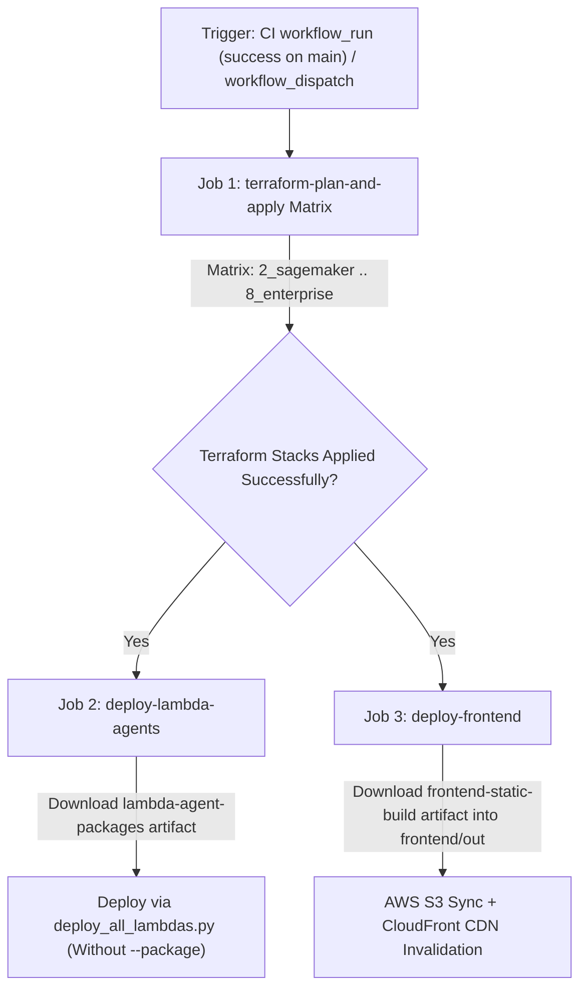

# Specification: Continuous Deployment (CD) Workflow & Production Infrastructure Release 🚀

## Status: APPROVED
**Module**: `infrastructure / cd / github_actions`  
**Target Files**:
- [.github/workflows/cd.yml](file:///Users/aponte/personal_workspace/agent_engineering_production_udemy/projects/alex/.github/workflows/cd.yml)
- [backend/deploy_all_lambdas.py](file:///Users/aponte/personal_workspace/agent_engineering_production_udemy/projects/alex/backend/deploy_all_lambdas.py)
- [frontend/package.json](file:///Users/aponte/personal_workspace/agent_engineering_production_udemy/projects/alex/frontend/package.json)
- [terraform/2_sagemaker/main.tf](file:///Users/aponte/personal_workspace/agent_engineering_production_udemy/projects/alex/terraform/2_sagemaker/main.tf)
- [terraform/3_ingestion/main.tf](file:///Users/aponte/personal_workspace/agent_engineering_production_udemy/projects/alex/terraform/3_ingestion/main.tf)
- [terraform/4_researcher/main.tf](file:///Users/aponte/personal_workspace/agent_engineering_production_udemy/projects/alex/terraform/4_researcher/main.tf)
- [terraform/5_database/main.tf](file:///Users/aponte/personal_workspace/agent_engineering_production_udemy/projects/alex/terraform/5_database/main.tf)
- [terraform/6_agents/main.tf](file:///Users/aponte/personal_workspace/agent_engineering_production_udemy/projects/alex/terraform/6_agents/main.tf)
- [terraform/7_frontend/main.tf](file:///Users/aponte/personal_workspace/agent_engineering_production_udemy/projects/alex/terraform/7_frontend/main.tf)
- [terraform/8_enterprise/main.tf](file:///Users/aponte/personal_workspace/agent_engineering_production_udemy/projects/alex/terraform/8_enterprise/main.tf)
- [docs/specs/infrastructure/github_cd_spec.md](file:///Users/aponte/personal_workspace/agent_engineering_production_udemy/projects/alex/docs/specs/infrastructure/github_cd_spec.md)

---

## 1. Executive Summary & Objectives

This specification defines the production-grade Continuous Deployment (CD) pipeline architecture for Project Alex. The CD workflow orchestrates automated infrastructure provisioning across multi-stack Terraform modules, containerized Lambda agent deployments, Next.js frontend asset delivery to AWS S3, and CloudFront CDN cache invalidations following successful Continuous Integration (CI) runs on the `main` branch or via manual dispatch.

### Key Objectives & Architectural Principles:
1. **Automated Continuous Deployment Trigger Scope**: Automatically triggers deployment following successful completion of the CI workflow ([docs/specs/infrastructure/github_ci_spec.md](file:///Users/aponte/personal_workspace/agent_engineering_production_udemy/projects/alex/docs/specs/infrastructure/github_ci_spec.md)) on `main` via `workflow_run` events, or on-demand via manual `workflow_dispatch`.
2. **Passwordless AWS Authentication (OIDC)**: Integrates GitHub Actions OpenID Connect (OIDC) identity provider federation (`aws-actions/configure-aws-credentials`) using IAM role assumption (`role-to-assume: ${{ secrets.AWS_ROLE_ARN }}`), eliminating long-lived access key secrets.
3. **Terraform Stack Matrix Provisioning**: Executes `terraform fmt -check`, `terraform init`, `terraform validate`, and `terraform apply -auto-approve` sequentially across all active Terraform modules (`2_sagemaker` through `8_enterprise`).
4. **Consuming Pre-Packaged Lambda Artifacts**: Downloads the `lambda-agent-packages` zip artifacts uploaded during CI and invokes [backend/deploy_all_lambdas.py](file:///Users/aponte/personal_workspace/agent_engineering_production_udemy/projects/alex/backend/deploy_all_lambdas.py) **without** the `--package` flag. This consumes pre-built `.zip` archives directly and bypasses redundant Docker compilation in CD.
5. **Consuming Pre-Built Frontend Artifacts & CDN Invalidation**: Downloads pre-compiled `frontend-static-build` export artifacts directly into `frontend/out/`, synchronizes static assets to S3 (`aws s3 sync`), and invalidates CloudFront distributions (`aws cloudfront create-invalidation`), completely eliminating Node.js compilation and `npm` build steps in CD.
6. **Harness Standard Compliance**: Fully adheres to the harness architecture defined in [docs/specs/llm_agent_harness_spec.md](file:///Users/aponte/personal_workspace/agent_engineering_production_udemy/projects/alex/docs/specs/llm_agent_harness_spec.md) and deployment patterns in [docs/specs/infrastructure/scheduler_and_deployment_spec.md](file:///Users/aponte/personal_workspace/agent_engineering_production_udemy/projects/alex/docs/specs/infrastructure/scheduler_and_deployment_spec.md).

> [!IMPORTANT]
> Infrastructure deployment safety is governed by non-preemptive concurrency locks (`cancel-in-progress: false`). Ongoing `terraform apply` operations are never aborted mid-execution, protecting state backends against lock corruption.

---

## 2. Technical Contracts & Interface Specifications

### 2.1 Workflow Triggers & Artifact Inheritance Mechanism

The CD pipeline triggers automatically upon successful completion of the Continuous Integration (CI) pipeline on the `main` branch, or via manual dispatch from the GitHub Actions UI:

```yaml
on:
  workflow_run:
    workflows: ["Continuous Integration"]
    types:
      - completed
    branches:
      - main
  workflow_dispatch:
    inputs:
      run_id:
        description: 'CI Workflow Run ID (optional, defaults to triggering/latest CI run)'
        required: false
        type: string
```

#### CI Artifact Inheritance Protocol:
1. **CI Artifact Generation**: The CI workflow ([docs/specs/infrastructure/github_ci_spec.md](file:///Users/aponte/personal_workspace/agent_engineering_production_udemy/projects/alex/docs/specs/infrastructure/github_ci_spec.md)) produces two validated build artifacts:
   - `frontend-static-build`: Exported static build HTML/JS assets from `frontend/out`.
   - `lambda-agent-packages`: Pre-packaged `.zip` archives for all 5 Agent Orchestra Lambdas (`planner`, `tagger`, `reporter`, `charter`, `retirement`) and the `scheduler` Lambda.
2. **Quality Gate Guardrail**: The CD workflow inspects the CI execution result:
   ```yaml
   if: ${{ github.event_name == 'workflow_dispatch' || github.event.workflow_run.conclusion == 'success' }}
   ```
   Deployments are blocked if the triggering CI run failed.
3. **Artifact Retrieval**: Artifacts are fetched in CD using `actions/download-artifact@v4` with explicit `run-id` binding (`run-id: ${{ inputs.run_id || github.event.workflow_run.id }}`) and `github-token: ${{ secrets.GITHUB_TOKEN }}`.

#### Concurrency Policy:
To ensure infrastructure state lock integrity and prevent concurrent state corruption during `terraform apply` operations, the workflow enforces non-preemptive execution:

```yaml
concurrency:
  group: cd-main-${{ github.ref }}
  cancel-in-progress: false
```

---

### 2.2 AWS IAM OIDC Authentication Protocol

The pipeline utilizes temporary AWS security credentials generated through IAM OpenID Connect (OIDC) federation. Long-lived `AWS_ACCESS_KEY_ID` and `AWS_SECRET_ACCESS_KEY` pair usage is prohibited.

#### Required Action Permissions:
To request the OIDC JSON Web Token (JWT) from GitHub's OIDC provider, job definitions MUST declare top-level or job-level `permissions`:

```yaml
permissions:
  id-token: write
  contents: read
```

#### Authentication Step Contract:
```yaml
- name: Configure AWS Credentials via OIDC
  uses: aws-actions/configure-aws-credentials@v4
  with:
    role-to-assume: ${{ secrets.AWS_ROLE_ARN }}
    aws-region: ${{ secrets.AWS_REGION || 'us-east-1' }}
    role-session-name: Alex-CD-GitHubActions
```

> [!NOTE]
> The IAM Role assumed by GitHub Actions must configure an OIDC Trust Policy allowing `repo:<org>/<repo>:ref:refs/heads/main` or `repo:<org>/<repo>:*` with claim audience `sts.amazonaws.com`.

---

### 2.3 Pipeline Job Architecture & Topology

The CD pipeline comprises **3 main jobs**:



#### CD Job Interface Matrix:

| Job ID | Description & Scope | Target Working Directory | Execution Commands & CLI | Dependencies (`needs`) |
| :--- | :--- | :--- | :--- | :--- |
| `terraform-plan-and-apply` | Matrix provisioning across Terraform stacks (`2_sagemaker` through `8_enterprise`) | `terraform/${{ matrix.stack }}` | `terraform fmt -check`<br>`terraform init`<br>`terraform validate`<br>`terraform apply -auto-approve` | *None (Initial Quality Gate)* |
| `deploy-lambda-agents` | Lambda resource recreation & deployment using CI pre-packaged `.zip` artifacts | [backend/](file:///Users/aponte/personal_workspace/agent_engineering_production_udemy/projects/alex/backend/) | `actions/download-artifact@v4`<br>`uv run deploy_all_lambdas.py` | `terraform-plan-and-apply` |
| `deploy-frontend` | Static asset synchronization to S3 & CloudFront cache invalidation using CI pre-built artifacts | [frontend/](file:///Users/aponte/personal_workspace/agent_engineering_production_udemy/projects/alex/frontend/) | `actions/download-artifact@v4`<br>`aws s3 sync frontend/out/ s3://${{ secrets.AWS_S3_FRONTEND_BUCKET }} --delete`<br>`aws cloudfront create-invalidation` | `terraform-plan-and-apply` |

---

### 2.4 Terraform Matrix Execution Protocol

The `terraform-plan-and-apply` job runs across a matrix of the 7 Terraform modules defining Project Alex infrastructure:

```yaml
strategy:
  fail-fast: true
  max-parallel: 1  # Ensures sequential stack application to prevent dependency race conditions
  matrix:
    stack:
      - 2_sagemaker
      - 3_ingestion
      - 4_researcher
      - 5_database
      - 6_agents
      - 7_frontend
      - 8_enterprise
```

> [!TIP]
> `max-parallel: 1` guarantees strictly ordered execution (`2_sagemaker` → `3_ingestion` → `4_researcher` → `5_database` → `6_agents` → `7_frontend` → `8_enterprise`), matching cross-stack dependency order. `fail-fast: true` immediately halts execution if any preceding stack fails.

For each stack item in the matrix, the job executes four mandatory Terraform lifecycle commands:
1. `terraform fmt -check`: Verifies HCL syntax formatting.
2. `terraform init`: Initializes remote state backends and provider plugins.
3. `terraform validate`: Validates resource schema and reference integrity.
4. `terraform apply -auto-approve`: Applies infrastructure changes non-interactively.

---

### 2.5 Lambda Agent Deployment Contract

The `deploy-lambda-agents` job executes [backend/deploy_all_lambdas.py](file:///Users/aponte/personal_workspace/agent_engineering_production_udemy/projects/alex/backend/deploy_all_lambdas.py) **without** the `--package` flag (`uv run deploy_all_lambdas.py`).

#### Execution & Consumption Logic:
1. **Artifact Extraction**: `actions/download-artifact@v4` places pre-packaged `.zip` files into `backend/`:
   - `backend/planner/planner_lambda.zip`
   - `backend/tagger/tagger_lambda.zip`
   - `backend/reporter/reporter_lambda.zip`
   - `backend/charter/charter_lambda.zip`
   - `backend/retirement/retirement_lambda.zip`
   - `backend/scheduler/lambda_function.zip`
2. **Package Check Bypass**: When `deploy_all_lambdas.py` executes without `--package`, it verifies the existence of all 6 `.zip` archives. Because they were pre-packaged during CI and extracted from the artifact, the script logs their sizes and skips running `package_docker.py` or `package_scheduler.py`.
3. **Terraform Taint & Recreation**: The script taints `aws_lambda_function` resources in [terraform/6_agents](file:///Users/aponte/personal_workspace/agent_engineering_production_udemy/projects/alex/terraform/6_agents) (`planner`, `tagger`, `reporter`, `charter`, `retirement`) and [terraform/4_researcher](file:///Users/aponte/personal_workspace/agent_engineering_production_udemy/projects/alex/terraform/4_researcher) (`scheduler_lambda`, `researcher`), forcing Terraform to recreate the functions with the updated zip contents.
4. **Terraform Apply**: Runs `terraform apply -auto-approve` on `6_agents` and `4_researcher` stacks.

> [!NOTE]
> Consuming pre-packaged zip artifacts removes the requirement for Docker daemon execution in the CD runner during `deploy-lambda-agents`, significantly speeding up deployment times.

---

### 2.6 Frontend Deployment Contract

The `deploy-frontend` job receives pre-compiled static web application files and deploys them directly to AWS infrastructure:

1. **Artifact Download**: `actions/download-artifact@v4` downloads the `frontend-static-build` artifact directly into `frontend/out/`.
2. **Node.js Compilation Elimination**: Because compilation (`npm run build`) was performed in CI, CD requires **no Node.js setup, no `npm ci`, and no build scripts**.
3. **S3 Asset Synchronization**: Executes `aws s3 sync frontend/out/ s3://${{ secrets.AWS_S3_FRONTEND_BUCKET }} --delete` to sync static assets to the target S3 bucket.
4. **CloudFront CDN Cache Invalidation**: Clears edge caches using `aws cloudfront create-invalidation --distribution-id ${{ secrets.CLOUDFRONT_DISTRIBUTION_ID }} --paths "/*"`.

---

### 2.7 Required Environment Variables & GitHub Secrets Matrix

The CD pipeline relies on repository secrets and environment variables configured within GitHub:

| Secret / Var Name | Description | Required By Job | Example / Usage |
| :--- | :--- | :--- | :--- |
| `AWS_ROLE_ARN` | AWS IAM Role ARN configured for GitHub Actions OIDC trust relationship | All Jobs (`configure-aws-credentials`) | `arn:aws:iam::123456789012:role/alex-github-actions-cd-role` |
| `AWS_REGION` | Target AWS deployment region | All Jobs | `us-east-1` |
| `CLERK_JWKS_URL` | Clerk JWKS URL for JWT validation in API Gateway Lambda | `terraform-plan-and-apply` (`7_frontend`), `deploy-lambda-agents` | `https://<clerk-domain>/.well-known/jwks.json` |
| `AWS_S3_FRONTEND_BUCKET` | S3 bucket name created by `7_frontend` Terraform stack | `deploy-frontend` | `alex-frontend-123456789012` |
| `CLOUDFRONT_DISTRIBUTION_ID` | CloudFront Distribution ID created by `7_frontend` Terraform stack | `deploy-frontend` | `E1A2B3C4D5E6F7` |
| `POLYGON_API_KEY` | Polygon.io API key for real-time market price data | `terraform-plan-and-apply` (`6_agents`), `deploy-lambda-agents` | `poly_key_...` |
| `OPENAI_API_KEY` | OpenAI API key for Researcher Lambda and Agents SDK tracing | `terraform-plan-and-apply` (`4_researcher`, `6_agents`), `deploy-lambda-agents` | `sk-proj-...` |
| `ALEX_API_KEY` | Internal Alex API key for inter-service communication | `terraform-plan-and-apply` (`4_researcher`) | `alex_secret_key_...` |
| `GITHUB_TOKEN` | Automatic GitHub token for cross-workflow artifact downloads | `deploy-lambda-agents`, `deploy-frontend` | `${{ secrets.GITHUB_TOKEN }}` |

---

## 3. Implementation Plan & Execution Steps

Below is the complete, production-grade GitHub Actions workflow definition target for [.github/workflows/cd.yml](file:///Users/aponte/personal_workspace/agent_engineering_production_udemy/projects/alex/.github/workflows/cd.yml):

```yaml
name: Continuous Deployment

on:
  workflow_run:
    workflows: ["Continuous Integration"]
    types:
      - completed
    branches:
      - main
  workflow_dispatch:
    inputs:
      run_id:
        description: 'CI Workflow Run ID (optional, defaults to triggering/latest CI run)'
        required: false
        type: string

concurrency:
  group: cd-main-${{ github.ref }}
  cancel-in-progress: false

permissions:
  id-token: write
  contents: read

jobs:
  # ---------------------------------------------------------------------------
  # Job 1: Terraform Plan & Apply Matrix (Stacks 2_sagemaker through 8_enterprise)
  # ---------------------------------------------------------------------------
  terraform-plan-and-apply:
    name: Terraform Apply (${{ matrix.stack }})
    runs-on: ubuntu-latest
    if: ${{ github.event_name == 'workflow_dispatch' || github.event.workflow_run.conclusion == 'success' }}
    timeout-minutes: 30
    strategy:
      fail-fast: true
      max-parallel: 1
      matrix:
        stack:
          - 2_sagemaker
          - 3_ingestion
          - 4_researcher
          - 5_database
          - 6_agents
          - 7_frontend
          - 8_enterprise

    steps:
      - name: Checkout Code
        uses: actions/checkout@v4

      - name: Configure AWS Credentials via OIDC
        uses: aws-actions/configure-aws-credentials@v4
        with:
          role-to-assume: ${{ secrets.AWS_ROLE_ARN }}
          aws-region: ${{ secrets.AWS_REGION || 'us-east-1' }}
          role-session-name: Alex-CD-Terraform-${{ matrix.stack }}

      - name: Setup Terraform CLI
        uses: hashicorp/setup-terraform@v3
        with:
          terraform_version: "1.9.0"

      - name: Terraform Format Check
        working-directory: terraform/${{ matrix.stack }}
        run: terraform fmt -check

      - name: Terraform Init
        working-directory: terraform/${{ matrix.stack }}
        run: terraform init

      - name: Terraform Validate
        working-directory: terraform/${{ matrix.stack }}
        run: terraform validate

      - name: Terraform Apply
        working-directory: terraform/${{ matrix.stack }}
        env:
          TF_VAR_aws_region: ${{ secrets.AWS_REGION || 'us-east-1' }}
          TF_VAR_clerk_jwks_url: ${{ secrets.CLERK_JWKS_URL }}
          TF_VAR_polygon_api_key: ${{ secrets.POLYGON_API_KEY }}
          TF_VAR_openai_api_key: ${{ secrets.OPENAI_API_KEY }}
          TF_VAR_alex_api_key: ${{ secrets.ALEX_API_KEY }}
        run: terraform apply -auto-approve

  # ---------------------------------------------------------------------------
  # Job 2: Unified Lambda Agent Deployment (Using Pre-built CI Packages)
  # ---------------------------------------------------------------------------
  deploy-lambda-agents:
    name: Deploy Lambda Agents & Subsystems
    runs-on: ubuntu-latest
    needs: terraform-plan-and-apply
    timeout-minutes: 20
    steps:
      - name: Checkout Code
        uses: actions/checkout@v4

      - name: Configure AWS Credentials via OIDC
        uses: aws-actions/configure-aws-credentials@v4
        with:
          role-to-assume: ${{ secrets.AWS_ROLE_ARN }}
          aws-region: ${{ secrets.AWS_REGION || 'us-east-1' }}
          role-session-name: Alex-CD-Lambda-Deploy

      - name: Download Lambda Agent Packages Artifact
        uses: actions/download-artifact@v4
        with:
          name: lambda-agent-packages
          path: backend/
          run-id: ${{ inputs.run_id || github.event.workflow_run.id }}
          github-token: ${{ secrets.GITHUB_TOKEN }}

      - name: Setup Python & uv
        uses: astral-sh/setup-uv@v5
        with:
          version: "latest"
          enable-cache: true
          cache-dependency-glob: "backend/uv.lock"

      - name: Setup Terraform CLI
        uses: hashicorp/setup-terraform@v3
        with:
          terraform_version: "1.9.0"

      - name: Install Backend Dependencies
        working-directory: backend
        run: uv sync

      - name: Execute Lambda Deployment Script
        working-directory: backend
        env:
          TF_VAR_aws_region: ${{ secrets.AWS_REGION || 'us-east-1' }}
          TF_VAR_clerk_jwks_url: ${{ secrets.CLERK_JWKS_URL }}
          TF_VAR_polygon_api_key: ${{ secrets.POLYGON_API_KEY }}
          TF_VAR_openai_api_key: ${{ secrets.OPENAI_API_KEY }}
          TF_VAR_alex_api_key: ${{ secrets.ALEX_API_KEY }}
        run: uv run deploy_all_lambdas.py

  # ---------------------------------------------------------------------------
  # Job 3: Frontend Deploy S3 Sync & CloudFront Invalidation (Using Pre-built CI Artifacts)
  # ---------------------------------------------------------------------------
  deploy-frontend:
    name: Deploy Next.js Frontend & Invalidate CloudFront
    runs-on: ubuntu-latest
    needs: terraform-plan-and-apply
    timeout-minutes: 15
    steps:
      - name: Checkout Code
        uses: actions/checkout@v4

      - name: Configure AWS Credentials via OIDC
        uses: aws-actions/configure-aws-credentials@v4
        with:
          role-to-assume: ${{ secrets.AWS_ROLE_ARN }}
          aws-region: ${{ secrets.AWS_REGION || 'us-east-1' }}
          role-session-name: Alex-CD-Frontend-Deploy

      - name: Download Frontend Static Export Artifact
        uses: actions/download-artifact@v4
        with:
          name: frontend-static-build
          path: frontend/out
          run-id: ${{ inputs.run_id || github.event.workflow_run.id }}
          github-token: ${{ secrets.GITHUB_TOKEN }}

      - name: Sync Static Frontend Artifacts to S3
        run: |
          aws s3 sync frontend/out/ s3://${{ secrets.AWS_S3_FRONTEND_BUCKET }} --delete

      - name: Invalidate CloudFront CDN Cache
        run: |
          aws cloudfront create-invalidation \
            --distribution-id ${{ secrets.CLOUDFRONT_DISTRIBUTION_ID }} \
            --paths "/*"
```

---

## 4. Verification & Testing Requirements

### 4.1 Pre-deployment Local Verification Commands

Before committing workflow updates, engineers and AI agents can execute equivalent local verification commands:

```bash
# 1. Verify Terraform Formatting & Validation across Stacks
for dir in terraform/*/; do
  if [ -f "$dir/main.tf" ]; then
    echo "Checking $dir..."
    (cd "$dir" && terraform fmt -check && terraform init -backend=false && terraform validate)
  fi
done

# 2. Verify Lambda Deployment Script with Existing Zip Artifacts
cd backend && uv run deploy_all_lambdas.py

# 3. Verify Frontend Static Directory Sync Format
test -d frontend/out && echo "Frontend build directory exists"
```

### 4.2 GitHub Actions Live Verification Checklist

When triggering a CD pipeline run via `workflow_run` (following CI on `main`) or `workflow_dispatch`:
1. **OIDC Authentication Check**: Confirm `Configure AWS Credentials via OIDC` step successfully assumes `AWS_ROLE_ARN` without requesting long-lived AWS keys.
2. **Terraform Matrix Audit**: Confirm all 7 Terraform stacks (`2_sagemaker` through `8_enterprise`) complete `terraform apply` cleanly in sequential order.
3. **Lambda Artifact Download & Deployment Audit**: Confirm `deploy-lambda-agents` downloads `lambda-agent-packages`, recognizes existing `.zip` files, skips re-packaging, taints Lambda functions, and completes deployment cleanly.
4. **Frontend Artifact Download & CDN Audit**: Confirm `deploy-frontend` downloads `frontend-static-build` into `frontend/out/`, uploads static assets to `AWS_S3_FRONTEND_BUCKET`, and issues a successful CloudFront cache invalidation request (`Status: InProgress` or `Completed`).
