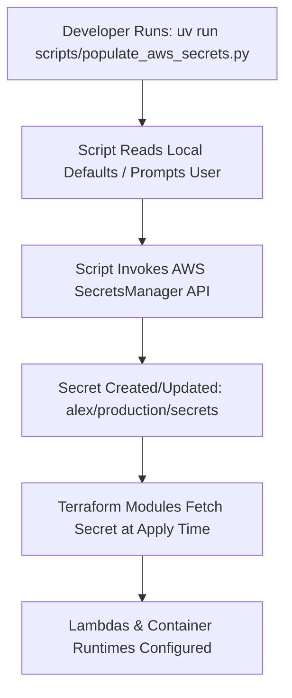

# Specification: Production Secrets Management & AWS Secrets Manager Integration 🔒

## Status: APPROVED
**Module**: `infrastructure / security / secrets_management`  
**Target Files**:
- [scripts/populate_aws_secrets.py](file:///Users/aponte/personal_workspace/agent_engineering_production_udemy/projects/alex/scripts/populate_aws_secrets.py)
- [.gitignore](file:///Users/aponte/personal_workspace/agent_engineering_production_udemy/projects/alex/.gitignore)
- [terraform/4_researcher/main.tf](file:///Users/aponte/personal_workspace/agent_engineering_production_udemy/projects/alex/terraform/4_researcher/main.tf)
- [terraform/6_agents/main.tf](file:///Users/aponte/personal_workspace/agent_engineering_production_udemy/projects/alex/terraform/6_agents/main.tf)
- [terraform/7_frontend/main.tf](file:///Users/aponte/personal_workspace/agent_engineering_production_udemy/projects/alex/terraform/7_frontend/main.tf)
- [.github/workflows/reusable-terraform-apply.yml](file:///Users/aponte/personal_workspace/agent_engineering_production_udemy/projects/alex/.github/workflows/reusable-terraform-apply.yml)
- [.github/workflows/reusable-deploy-lambdas.yml](file:///Users/aponte/personal_workspace/agent_engineering_production_udemy/projects/alex/.github/workflows/reusable-deploy-lambdas.yml)
- [docs/specs/infrastructure/secrets_management_spec.md](file:///Users/aponte/personal_workspace/agent_engineering_production_udemy/projects/alex/docs/specs/infrastructure/secrets_management_spec.md)

---

## 1. Executive Summary & Objectives

This specification defines the production secrets management architecture for Project Alex. All sensitive credentials—including third-party API integration keys, authentication secrets, and subsystem keys—are centralized securely within **AWS Secrets Manager**, completely eliminating static production secrets in GitHub repository settings, CI/CD workflow files, or local Terraform `.tfvars` files.

### Key Objectives & Architectural Principles:
1. **Centralized Cloud Secret Governance**: Manages sensitive production credentials inside AWS Secrets Manager in a single application secret entry (`alex/production/secrets`), allowing key rotation without redeploying code or modifying repository settings.
2. **Zero Production Secrets in Version Control & CI**: Prohibits committing API keys or secret values into Git, `.env` files, or GitHub Actions workflow environment blocks.
3. **Least-Privilege Secret Segregation**: Maintains strict boundaries between AWS-managed database infrastructure credentials (`alex-aurora-credentials-*`) and application-level API integration keys (`alex/production/secrets`).
4. **Dynamic Infrastructure Resolution**: Enables Terraform modules (`4_researcher`, `6_agents`, `7_frontend`) to resolve credentials dynamically at `apply` time via `data "aws_secretsmanager_secret_version"` blocks.
5. **Zero Application Code Impact**: Populates Lambda and App Runner environment variables at infrastructure deployment time, enabling backend Python modules to read runtime environment variables seamlessly without code modifications.

---

## 2. Technical Contracts & Interface Specifications

### 2.1 Secrets Architecture & Boundary Segregation

Project Alex segregates secrets into two dedicated AWS Secrets Manager entries based on lifecycle and access scope:

| Secret Identifier | Owner & Lifecycle | Purpose | Access Scope |
| :--- | :--- | :--- | :--- |
| `alex-aurora-credentials-*` | AWS RDS / `terraform/5_database` | Database master username, password, engine metadata | RDS Data API & Database Client Lambdas |
| `alex/production/secrets` | User / [scripts/populate_aws_secrets.py](file:///Users/aponte/personal_workspace/agent_engineering_production_udemy/projects/alex/scripts/populate_aws_secrets.py) | Application API keys, authentication credentials, inter-service keys | Terraform Data Sources & Lambda Runtimes |

> [!IMPORTANT]
> The database master secret (`alex-aurora-credentials-*`) is managed independently by RDS and Terraform Part 5. Application integration keys (`alex/production/secrets`) are managed separately to prevent cross-domain key contamination and maintain IAM least privilege.

---

### 2.2 Terraform Dynamic Secret Resolution Contract

Terraform modules requiring application secrets instantiate an `aws_secretsmanager_secret_version` data source:

```hcl
# Data source for application secrets in AWS Secrets Manager
data "aws_secretsmanager_secret" "app_secrets" {
  name = "alex/production/secrets"
}

data "aws_secretsmanager_secret_version" "app_secrets" {
  secret_id = data.aws_secretsmanager_secret.app_secrets.id
}

locals {
  app_secrets = try(jsondecode(data.aws_secretsmanager_secret_version.app_secrets.secret_string), {})
}
```

#### Variable Fallback Pattern:
To support local development overrides while defaulting to AWS Secrets Manager in automated environments, Terraform variables use explicit fallback logic:

```hcl
locals {
  target_api_key = var.target_api_key != null && var.target_api_key != "" ? var.target_api_key : lookup(local.app_secrets, "KEY_NAME", "")
}
```

---

### 2.3 Automated One-Time Setup Script Contract

Secret entry creation and maintenance is automated via [scripts/populate_aws_secrets.py](file:///Users/aponte/personal_workspace/agent_engineering_production_udemy/projects/alex/scripts/populate_aws_secrets.py):

- **Script Path**: `scripts/populate_aws_secrets.py`
- **Gitignore Protection**: `.gitignore` explicitly ignores `scripts/populate_aws_secrets.py`, `scripts/secrets.json`, and `.env.secrets`.
- **Idempotent Operation**: Inspects whether `alex/production/secrets` exists in the target AWS region; executes `create_secret` if missing or `put_secret_value` if updating existing entries.
- **Environment Fallback**: Reads default key values from local `.env` files if present, prompting interactively for unpopulated entries.

---

### 2.4 CI/CD Pipeline Secret Isolation

Continuous Integration (CI) and Continuous Deployment (CD) workflows run with **zero API key secrets** passed in GitHub Actions workflow definitions:

1. **GitHub Secrets Minimal Scope**: Only `AWS_ROLE_ARN` (the IAM OIDC Role) and public non-sensitive configuration keys are defined in GitHub Repository Secrets.
2. **IAM OIDC Secret Access**: During CD runs, GitHub Actions authenticates via AWS OIDC (`aws-actions/configure-aws-credentials`). Terraform retrieves secrets dynamically from AWS Secrets Manager using the assumed IAM role permissions (`secretsmanager:GetSecretValue`).
3. **Workflow Code Cleanliness**: Reusable workflow files ([.github/workflows/reusable-terraform-apply.yml](file:///Users/aponte/personal_workspace/agent_engineering_production_udemy/projects/alex/.github/workflows/reusable-terraform-apply.yml), [.github/workflows/reusable-deploy-lambdas.yml](file:///Users/aponte/personal_workspace/agent_engineering_production_udemy/projects/alex/.github/workflows/reusable-deploy-lambdas.yml)) contain no `TF_VAR_*` API key environment variables.

---

## 3. Implementation Plan & Execution Steps

### 3.1 Initial Secrets Provisioning Workflow



### 3.2 Key Rotation Protocol

To rotate an application credential:
1. Run `uv run scripts/populate_aws_secrets.py` to update the secret value in AWS Secrets Manager.
2. Trigger the CD deployment workflow (`git push main` or `workflow_dispatch`) to re-apply Terraform stacks and update Lambda environment configurations.
3. Zero code changes or GitHub Actions secret updates are required.

---

## 4. Performance & SLA Benchmarks

1. **Zero Runtime Secret Retrieval Latency**: Because secrets are injected as environment variables during Terraform infrastructure provisioning, Lambda execution latency is unaffected (0 ms runtime secret fetch overhead).
2. **Sub-Second Setup Execution**: The setup script [scripts/populate_aws_secrets.py](file:///Users/aponte/personal_workspace/agent_engineering_production_udemy/projects/alex/scripts/populate_aws_secrets.py) completes secret creation/updating in **< 1.5 seconds**.

---

## 5. Verification & Testing Requirements

### 5.1 Local Verification Protocol

```bash
# 1. Verify populate script exists and is gitignored
git check-ignore -v scripts/populate_aws_secrets.py

# 2. Run populate script to verify AWS connection and secret existence
uv run scripts/populate_aws_secrets.py

# 3. Validate Terraform syntax across modules
for dir in terraform/*/; do
  if [ -f "$dir/main.tf" ]; then
    (cd "$dir" && terraform fmt -check && terraform init -backend=false && terraform validate)
  fi
done
```

### 5.2 Security & Compliance Audit Checklist

- [x] Zero API key values committed in Git repository history or workflow YAML files.
- [x] `scripts/populate_aws_secrets.py` listed in [.gitignore](file:///Users/aponte/personal_workspace/agent_engineering_production_udemy/projects/alex/.gitignore).
- [x] Database credentials (`alex-aurora-credentials-*`) kept separate from application secrets (`alex/production/secrets`).
- [x] Terraform modules resolve credentials dynamically via AWS Secrets Manager data sources.
